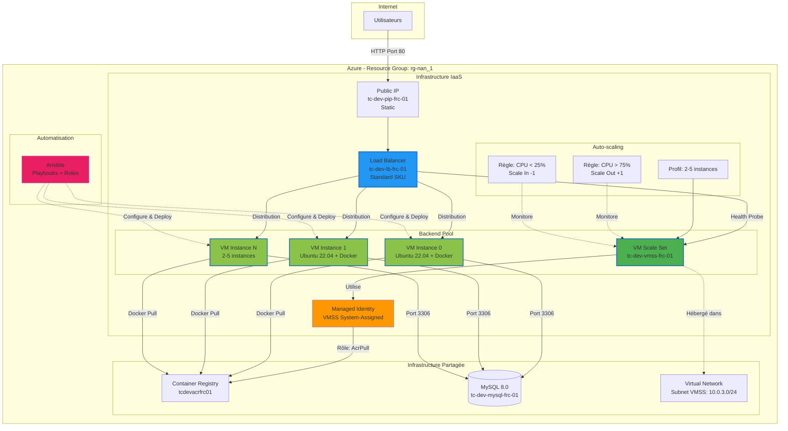
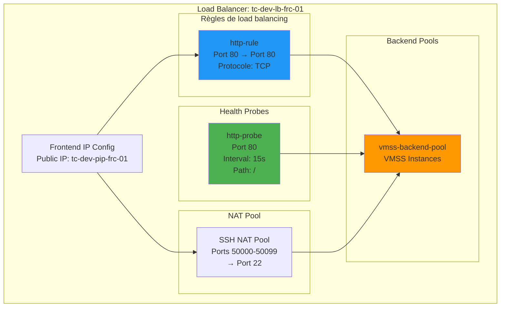
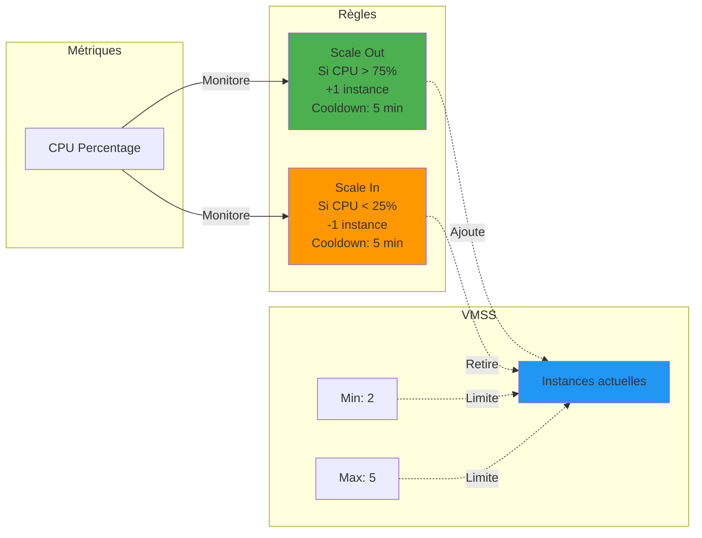
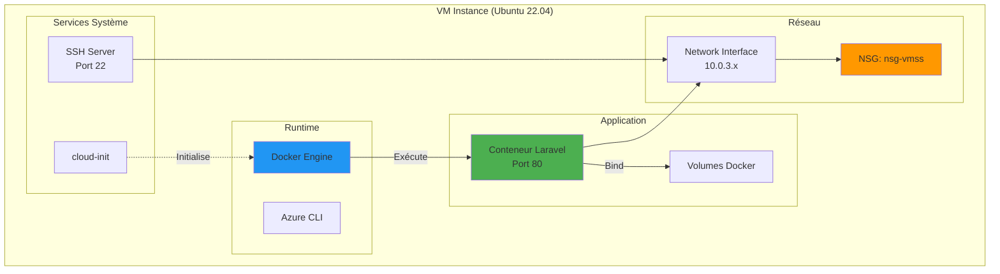
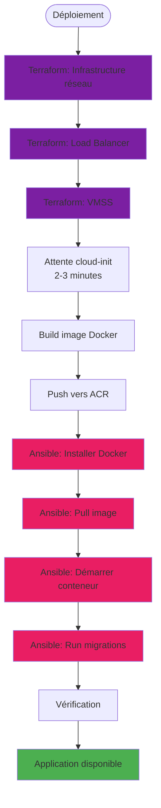
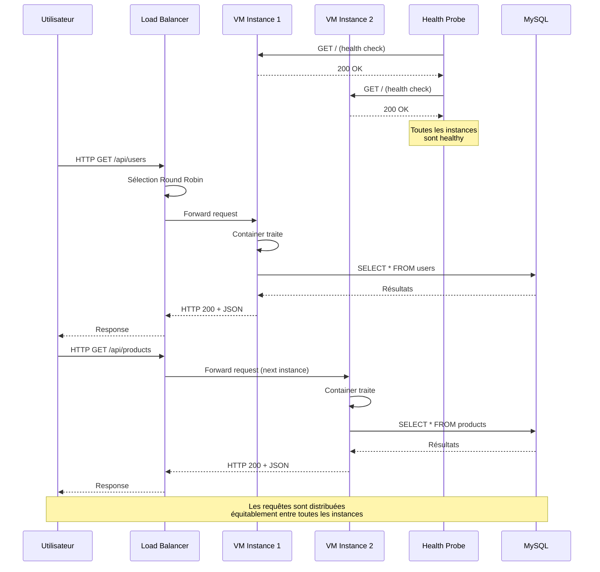
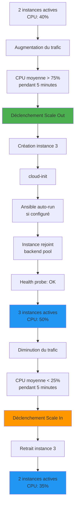

# Architecture IaaS - VM Scale Set avec Load Balancer

## Vue d'ensemble

L'approche IaaS (Infrastructure as a Service) utilise des machines virtuelles dans un VM Scale Set, orchestrées par un Load Balancer. Cette architecture offre un contrôle total sur l'infrastructure et une flexibilité maximale, au prix d'une complexité accrue et d'une maintenance manuelle.

## Diagramme d'architecture



## Composants IaaS

### Public IP

#### Caractéristiques

- **Nom**: `tc-dev-pip-frc-01`
- **Type**: Static (IPv4)
- **SKU**: Standard
- **Assignment**: Statique
- **DNS Label**: `tc-dev-lb` (optionnel)

#### Usage

Adresse IP publique attachée au Load Balancer pour recevoir le trafic Internet.

```bash
# Obtenir l'IP publique
az network public-ip show \
  --name tc-dev-pip-frc-01 \
  --resource-group rg-nan_1 \
  --query ipAddress -o tsv
```

### Load Balancer

#### Caractéristiques

- **Nom**: `tc-dev-lb-frc-01`
- **SKU**: Standard
- **Type**: Public
- **Région**: France Central
- **Frontend IP**: Public IP statique
- **Backend Pool**: Instances VMSS

#### Configuration



#### Règles de load balancing

| Règle | Frontend | Backend | Port | Protocole | Distribution |
|-------|----------|---------|------|-----------|--------------|
| http-rule | Public IP | Backend Pool | 80 → 80 | TCP | Round Robin |

#### Health Probe

- **Protocole**: HTTP
- **Port**: 80
- **Path**: `/`
- **Intervalle**: 15 secondes
- **Nombre d'échecs**: 2 avant de retirer l'instance

#### NAT Pool (Inbound NAT)

- **Ports**: 50000-50099
- **Destination**: Port 22 (SSH)
- **Usage**: Accès SSH aux instances individuelles

```bash
# SSH vers instance 0
ssh -i ~/.ssh/terracloud-key azureuser@<LOAD_BALANCER_IP> -p 50000

# SSH vers instance 1
ssh -i ~/.ssh/terracloud-key azureuser@<LOAD_BALANCER_IP> -p 50001
```

### VM Scale Set (VMSS)

#### Caractéristiques

- **Nom**: `tc-dev-vmss-frc-01`
- **OS**: Ubuntu 22.04 LTS
- **SKU**: Standard_B2s
  - 2 vCPUs
  - 4 GB RAM
  - Burstable (adapté au dev)
- **Instances**: 2 minimum, 5 maximum
- **Upgrade Policy**: Manual
- **Overprovision**: Disabled

#### Configuration cloud-init

Les VMs sont initialisées avec cloud-init pour:

```yaml
#cloud-config
package_update: true
package_upgrade: true
packages:
  - apt-transport-https
  - ca-certificates
  - curl
  - gnupg
  - lsb-release

# Azure CLI et dépendances Ansible sont installés
# Docker est installé par Ansible ensuite
```

#### Identité managée

- **Type**: System-Assigned
- **Permissions**: Rôle `AcrPull` sur le Container Registry
- **Usage**: Pull d'images Docker sans credentials

```bash
# Depuis une VM, se connecter avec l'identité managée
az login --identity

# Pull d'image depuis ACR
az acr login --name tcdevacrfrc01
docker pull tcdevacrfrc01.azurecr.io/sample-app:latest
```

#### Scaling Policy



**Règles d'auto-scaling:**

| Métrique | Condition | Action | Cooldown |
|----------|-----------|--------|----------|
| CPU Percentage | > 75% (moyenne 5 min) | +1 instance | 5 minutes |
| CPU Percentage | < 25% (moyenne 5 min) | -1 instance | 5 minutes |

### Architecture des VMs



### Conteneur Docker sur chaque VM

Chaque instance VMSS exécute un conteneur Docker:

```bash
docker run -d \
  --name laravel-app \
  --restart always \
  -p 80:80 \
  -e DB_HOST=tc-dev-mysql-frc-01.mysql.database.azure.com \
  -e DB_DATABASE=app_database \
  -e DB_USERNAME=app_admin \
  -e DB_PASSWORD=<secret> \
  tcdevacrfrc01.azurecr.io/sample-app:latest
```

## Flux de déploiement IaaS



### Étapes détaillées

#### 1. Déploiement Terraform (15-20 minutes)

```bash
cd terraform/envs/dev

terraform apply -target=module.loadbalancer \
                -target=module.vmss \
                -target=azurerm_role_assignment.vmss_acr_pull
```

Crée:
- Public IP
- Load Balancer avec règles
- VM Scale Set avec 2 instances
- Auto-scaling configuration
- Role assignments

#### 2. Construction et push de l'image (5 minutes)

```bash
cd sample-app-master/
az acr login --name tcdevacrfrc01
docker build -t tcdevacrfrc01.azurecr.io/sample-app:latest .
docker push tcdevacrfrc01.azurecr.io/sample-app:latest
```

#### 3. Déploiement Ansible (5-10 minutes)

```bash
cd ansible

# Installation de Docker sur toutes les VMs
ansible-playbook -i inventory/azure_rm.yml playbooks/docker-only.yml

# Déploiement de l'application
ansible-playbook -i inventory/azure_rm.yml playbooks/deploy-app.yml
```

## Ansible - Automatisation

### Structure

```
ansible/
├── inventory/
│   └── azure_rm.yml          # Inventaire dynamique Azure
├── playbooks/
│   ├── site.yml              # Playbook principal (tout)
│   ├── docker-only.yml       # Installation Docker
│   └── deploy-app.yml        # Déploiement application
├── roles/
│   ├── docker/               # Rôle installation Docker
│   └── app-deploy/           # Rôle déploiement app
└── group_vars/
    └── all.yml               # Variables communes
```

### Inventaire dynamique Azure

```yaml
# inventory/azure_rm.yml
plugin: azure.azcollection.azure_rm
auth_source: auto

include_vm_resource_groups:
  - rg-nan_1

keyed_groups:
  - key: tags.env
    prefix: env
  - key: tags.project
    prefix: project

conditional_groups:
  vmss_dev: "tags.env == 'dev' and 'vmss' in name"
```

### Rôle Docker

Installe et configure Docker:

```yaml
# roles/docker/tasks/main.yml
- name: Installer les dépendances
  apt:
    name:
      - apt-transport-https
      - ca-certificates
      - curl
      - gnupg
    state: present

- name: Ajouter la clé GPG Docker
  apt_key:
    url: https://download.docker.com/linux/ubuntu/gpg

- name: Installer Docker
  apt:
    name: docker-ce
    state: present

- name: Démarrer Docker
  service:
    name: docker
    state: started
    enabled: yes
```

### Rôle App Deploy

Déploie le conteneur Laravel:

```yaml
# roles/app-deploy/tasks/main.yml
- name: Login ACR avec managed identity
  shell: az acr login --name tcdevacrfrc01 --identity

- name: Pull image Docker
  docker_image:
    name: tcdevacrfrc01.azurecr.io/sample-app
    tag: latest
    source: pull

- name: Arrêter ancien conteneur
  docker_container:
    name: laravel-app
    state: absent

- name: Démarrer conteneur Laravel
  docker_container:
    name: laravel-app
    image: tcdevacrfrc01.azurecr.io/sample-app:latest
    state: started
    restart_policy: always
    ports:
      - "80:80"
    env:
      DB_HOST: "{{ mysql_host }}"
      DB_DATABASE: "{{ mysql_database }}"
      DB_USERNAME: "{{ mysql_username }}"
      DB_PASSWORD: "{{ mysql_password }}"

- name: Run migrations
  docker_container:
    name: laravel-app
    command: php artisan migrate --force
```

## Flux de requêtes utilisateur



## Scénario d'auto-scaling



## Sécurité

### Network Security Group (NSG)

Règles appliquées au subnet VMSS:

**Entrantes:**

| Priorité | Nom | Port | Source | Destination |
|-----------|-----|------|--------|-------------|
| 100 | Allow-HTTP | 80 | Internet | * |
| 110 | Allow-SSH-NAT | 22 | Load Balancer | * |
| 120 | Allow-HealthProbe | * | AzureLoadBalancer | * |

**Sortantes:**

| Priorité | Nom | Port | Destination |
|-----------|-----|------|-------------|
| 100 | Allow-MySQL | 3306 | VNet |
| 110 | Allow-ACR | 443 | Internet |
| 120 | Allow-Internet | * | Internet |

### Accès SSH

- Pas d'accès SSH direct depuis Internet
- Accès via NAT pool du Load Balancer uniquement
- Authentification par clé SSH uniquement (pas de mot de passe)

```bash
# SSH vers instance spécifique
ssh -i ~/.ssh/terracloud-key azureuser@<LB_IP> -p 5000X
```

### Identité managée pour ACR

Évite le stockage de credentials Docker:

```bash
# Sur la VM
az login --identity
az acr login --name tcdevacrfrc01
# Pas besoin de mot de passe!
```

## Avantages de l'approche IaaS

### Contrôle total

- Accès SSH aux VMs
- Configuration OS personnalisée
- Installation de packages spécifiques
- Logs et debugging approfondis

### Flexibilité

- Choix du runtime (Docker, bare metal, etc.)
- Configuration réseau avancée
- Optimisations de performance
- Support de n'importe quel workload

### Coût optimisable

- SKUs Burstable pour dev (B2s)
- Spot instances possibles
- Shutdown automatique en dev
- Scaling fin selon les besoins

### Architecture distribuée

- Multi-instances par défaut
- Haute disponibilité native
- Load balancing explicit

## Limitations de l'approche IaaS

### Complexité

- Configuration en multiple étapes
- Gestion des VMs nécessaire
- Debugging plus complexe
- Nécessite expertise DevOps

### Maintenance

- Patches de sécurité OS à gérer
- Mises à jour Docker manuelles
- Surveillance requise
- Backup à configurer

### Temps de déploiement

- 30+ minutes pour setup complet
- Scaling plus lent (boot VM + config)
- Déploiements coordonnés (Ansible)

### Outils additionnels

- Ansible requis
- Inventaire dynamique à maintenir
- Playbooks à écrire et tester

## Cas d'usage recommandés

L'approche IaaS est idéale pour:

- Applications nécessitant des configurations OS spécifiques
- Workloads avec patterns de trafic prévisibles
- Équipes DevOps expérimentées
- Besoin de debugging approfondi
- Contrôle des coûts à grande échelle
- Environnements hybrides (cloud + on-premise)
- Applications legacy nécessitant packages spécifiques

## Commandes utiles

```bash
# Lister les instances VMSS
az vmss list-instances \
  --name tc-dev-vmss-frc-01 \
  --resource-group rg-nan_1 \
  --output table

# Scaler manuellement
az vmss scale \
  --name tc-dev-vmss-frc-01 \
  --resource-group rg-nan_1 \
  --new-capacity 3

# Redémarrer une instance
az vmss restart \
  --name tc-dev-vmss-frc-01 \
  --resource-group rg-nan_1 \
  --instance-ids 0

# Voir les métriques CPU
az monitor metrics list \
  --resource $(az vmss show --name tc-dev-vmss-frc-01 --resource-group rg-nan_1 --query id -o tsv) \
  --metric "Percentage CPU"

# Voir l'historique d'auto-scaling
az monitor activity-log list \
  --resource-group rg-nan_1 \
  --offset 24h \
  --query "[?contains(operationName.value, 'Scale')]"

# Tester Ansible connectivity
ansible all -i inventory/azure_rm.yml -m ping

# Déployer sur toutes les VMs
ansible-playbook -i inventory/azure_rm.yml playbooks/site.yml

# Déployer sur une instance spécifique
ansible-playbook -i inventory/azure_rm.yml playbooks/deploy-app.yml --limit "10.0.3.4"
```

## Coûts estimés

| Ressource | Configuration | Coût mensuel (EUR) |
|-----------|--------------|-------------------|
| VMSS (2x B2s) | 2 instances | ~60 |
| Load Balancer Standard | 1 LB + règles | ~20 |
| Public IP Static | 1 IP | ~3 |
| Bande passante | ~10 GB sortant | ~1 |
| **Total IaaS** | | **~84** |
| Infrastructure partagée | (ACR + MySQL) | ~19 |
| **Total global** | | **~103** |

Économies possibles:
- Shutdown 19:00-08:00 (dev): -40%
- Spot instances: -80% (non recommandé pour prod)
- B1s au lieu de B2s: -50% (moins performant)

## Documents connexes

- [Vue d'ensemble](overview.md) - Architecture générale
- [Infrastructure partagée](infrastructure-shared.md) - Ressources communes
- [Architecture PaaS](architecture-paas.md) - Comparaison avec l'approche PaaS
- [Guide de déploiement IaaS](../deployment/deployment-iaas.md) - Procédure détaillée
- [Comparaison PaaS vs IaaS](../deployment/comparison.md) - Analyse comparative

