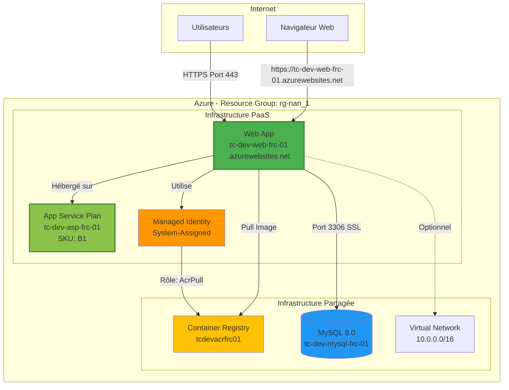
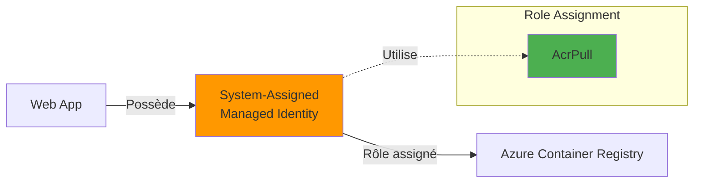
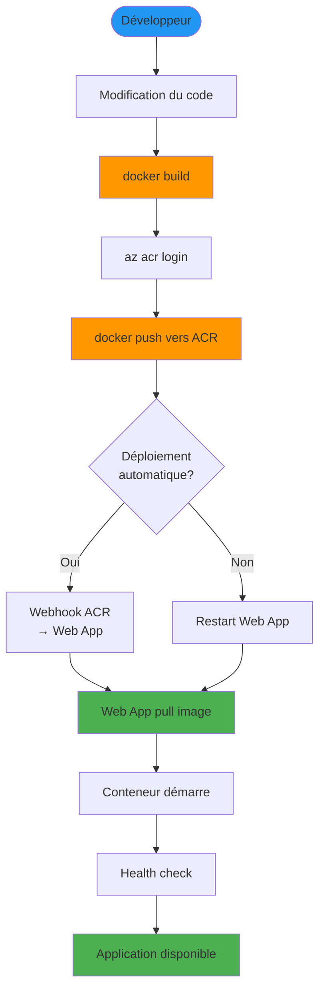
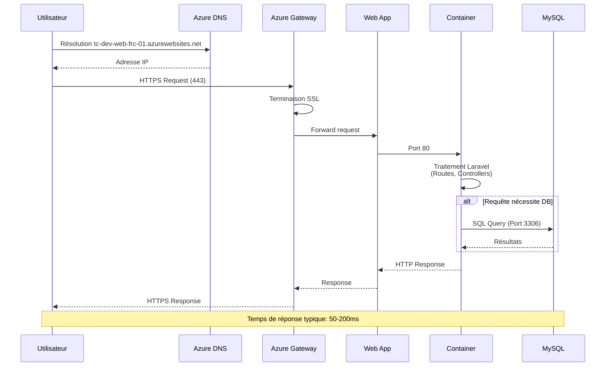
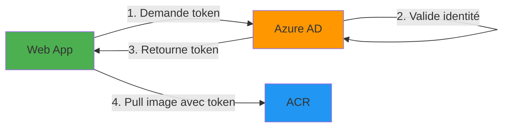

# Architecture PaaS - Azure App Service

## Vue d'ensemble

L'approche PaaS (Platform as a Service) utilise Azure App Service pour héberger l'application Laravel conteneurisée. Cette architecture offre une gestion simplifiée et une scalabilité automatique au prix d'un contrôle limité sur l'infrastructure sous-jacente.

## Diagramme d'architecture



## Composants PaaS

### App Service Plan

#### Caractéristiques

- **Nom**: `tc-dev-asp-frc-01`
- **SKU**: B1 (Basic)
  - 1 vCore
  - 1.75 GB RAM
  - 10 GB stockage
- **OS**: Linux
- **Région**: France Central
- **Instances**: 1 (scalable manuellement)

#### Configuration

```hcl
resource "azurerm_service_plan" "main" {
  name                = "tc-dev-asp-frc-01"
  location            = "francecentral"
  resource_group_name = "rg-nan_1"
  os_type             = "Linux"
  sku_name            = "B1"
  
  tags = {
    project = "TERRACLOUD"
    env     = "dev"
    # ... autres tags
  }
}
```

#### Capacités de scaling

**Scaling vertical (SKU):**
- B1 → B2 → B3 (Basic)
- S1 → S2 → S3 (Standard)
- P1v2 → P2v2 → P3v2 (Premium v2)

**Scaling horizontal:**
- Basic: Jusqu'à 3 instances
- Standard: Jusqu'à 10 instances
- Premium: Jusqu'à 30 instances

### Web App

#### Caractéristiques

- **Nom**: `tc-dev-web-frc-01`
- **URL**: `https://tc-dev-web-frc-01.azurewebsites.net`
- **Runtime**: Docker Container (Linux)
- **Image**: `tcdevacrfrc01.azurecr.io/sample-app:latest`
- **Always On**: Désactivé (B1)
- **HTTPS uniquement**: Recommandé

#### Configuration de l'image

```hcl
resource "azurerm_linux_web_app" "main" {
  name                = "tc-dev-web-frc-01"
  location            = "francecentral"
  resource_group_name = "rg-nan_1"
  service_plan_id     = azurerm_service_plan.main.id
  
  site_config {
    application_stack {
      docker_image     = "tcdevacrfrc01.azurecr.io/sample-app"
      docker_image_tag = "latest"
    }
    
    always_on = false
  }
  
  identity {
    type = "SystemAssigned"
  }
}
```

#### Variables d'environnement

Variables injectées dans le conteneur:

| Variable | Valeur | Description |
|----------|--------|-------------|
| `DB_CONNECTION` | mysql | Driver de base de données |
| `DB_HOST` | tc-dev-mysql-frc-01.mysql.database.azure.com | Serveur MySQL |
| `DB_PORT` | 3306 | Port MySQL |
| `DB_DATABASE` | app_database | Nom de la base |
| `DB_USERNAME` | app_admin | Utilisateur MySQL |
| `DB_PASSWORD` | `<secret>` | Mot de passe (sensible) |
| `WEBSITE_PORT` | 80 | Port d'écoute du conteneur |

### Identité managée

#### Type

- **Type**: System-Assigned (automatiquement créée avec la Web App)
- **Lifecycle**: Supprimée automatiquement avec la Web App
- **Avantage**: Pas de gestion de credentials

#### Permissions



Rôle assigné:

```hcl
resource "azurerm_role_assignment" "appservice_acr_pull" {
  principal_id         = azurerm_linux_web_app.main.identity[0].principal_id
  role_definition_name = "AcrPull"
  scope                = azurerm_container_registry.main.id
}
```

## Flux de déploiement



### Étapes détaillées

1. **Build de l'image**
   ```bash
   cd sample-app-master/
   docker build -t tcdevacrfrc01.azurecr.io/sample-app:latest .
   ```

2. **Push vers ACR**
   ```bash
   az acr login --name tcdevacrfrc01
   docker push tcdevacrfrc01.azurecr.io/sample-app:latest
   ```

3. **Déploiement automatique**
   - Web App détecte la nouvelle image (si webhook configuré)
   - Pull automatique de l'image
   - Redémarrage du conteneur

4. **Vérification**
   ```bash
   curl https://tc-dev-web-frc-01.azurewebsites.net
   ```

## Flux de requêtes utilisateur



## Sécurité

### Certificat SSL/TLS

- **Fournisseur**: Azure (gratuit)
- **Domaine**: `*.azurewebsites.net`
- **Renouvellement**: Automatique
- **Protocole**: TLS 1.2+

### Authentification ACR

Pas de mot de passe stocké:



### Pare-feu MySQL

La Web App accède à MySQL via:
- Règle de firewall `AllowAzureServices` (0.0.0.0)
- Authentification par username/password
- Connexion SSL possible

### Restrictions d'accès (optionnel)

Limitation des IPs autorisées:

```bash
az webapp config access-restriction add \
  --name tc-dev-web-frc-01 \
  --resource-group rg-nan_1 \
  --rule-name "AllowOfficeIP" \
  --action Allow \
  --ip-address "203.0.113.0/24" \
  --priority 100
```

## Monitoring et logs

### Logs applicatifs

```bash
# Logs en temps réel
az webapp log tail --name tc-dev-web-frc-01 --resource-group rg-nan_1

# Télécharger les logs
az webapp log download \
  --name tc-dev-web-frc-01 \
  --resource-group rg-nan_1 \
  --log-file app-logs.zip
```

### Métriques disponibles

- Temps de réponse HTTP
- Requêtes par seconde
- Erreurs HTTP (4xx, 5xx)
- Utilisation CPU
- Utilisation mémoire
- Bande passante entrante/sortante

### Application Insights (optionnel)

Pour monitoring avancé:

```bash
# Créer Application Insights
az monitor app-insights component create \
  --app tc-dev-appinsights \
  --location francecentral \
  --resource-group rg-nan_1

# Connecter à la Web App
INSTRUMENTATION_KEY=$(az monitor app-insights component show \
  --app tc-dev-appinsights \
  --resource-group rg-nan_1 \
  --query instrumentationKey -o tsv)

az webapp config appsettings set \
  --name tc-dev-web-frc-01 \
  --resource-group rg-nan_1 \
  --settings "APPINSIGHTS_INSTRUMENTATIONKEY=$INSTRUMENTATION_KEY"
```

## Haute disponibilité

### Limitations du tier Basic

- Une seule instance
- Pas de zone redundancy
- Pas d'auto-scaling

### Upgrade vers Standard/Premium

Pour production:

```hcl
resource "azurerm_service_plan" "main" {
  name     = "tc-prod-asp-frc-01"
  sku_name = "S1"  # Standard
  
  # Auto-scaling disponible
}

resource "azurerm_monitor_autoscale_setting" "main" {
  name                = "autoscale-webapp"
  resource_group_name = "rg-nan_1"
  location            = "francecentral"
  target_resource_id  = azurerm_service_plan.main.id
  
  profile {
    name = "default"
    capacity {
      default = 2
      minimum = 1
      maximum = 10
    }
    
    rule {
      metric_trigger {
        metric_name        = "CpuPercentage"
        metric_resource_id = azurerm_service_plan.main.id
        operator           = "GreaterThan"
        threshold          = 75
        time_aggregation   = "Average"
        time_window        = "PT5M"
        time_grain         = "PT1M"
      }
      
      scale_action {
        direction = "Increase"
        type      = "ChangeCount"
        value     = "1"
        cooldown  = "PT5M"
      }
    }
  }
}
```

## Avantages de l'approche PaaS

### Simplicité

- Déploiement en une commande Terraform
- Pas de gestion de serveurs
- Mises à jour de plateforme automatiques

### Scalabilité

- Scaling vertical simple (changement de SKU)
- Auto-scaling disponible (S1+)
- Load balancing automatique

### Intégration Azure

- Identités managées natives
- Intégration VNet disponible
- Support natif des conteneurs Docker

### Maintenance

- Patches de sécurité OS automatiques
- Monitoring intégré
- Backup disponible (S1+)

## Limitations de l'approche PaaS

### Contrôle limité

- Pas d'accès SSH aux serveurs
- Configuration limitée de l'OS
- Dépendance aux fonctionnalités supportées par Azure

### Coûts

- Coût fixe même avec faible utilisation
- Plus cher que IaaS à grande échelle
- Limitations du tier Basic

### Personnalisation

- Stack applicatif limité aux images supportées
- Certaines configurations avancées impossibles
- Dépendance au fournisseur (vendor lock-in)

## Cas d'usage recommandés

L'approche PaaS est idéale pour:

- Projets avec équipe réduite
- Applications standards (web apps, APIs)
- Prototypes et MVPs
- Environnements de développement
- Applications nécessitant un time-to-market rapide
- Équipes sans expertise DevOps approfondie

## Commandes utiles

```bash
# Redémarrer la Web App
az webapp restart --name tc-dev-web-frc-01 --resource-group rg-nan_1

# Voir la configuration
az webapp config show --name tc-dev-web-frc-01 --resource-group rg-nan_1

# SSH dans le conteneur (pour debugging)
az webapp ssh --name tc-dev-web-frc-01 --resource-group rg-nan_1

# Mettre à jour une variable d'environnement
az webapp config appsettings set \
  --name tc-dev-web-frc-01 \
  --resource-group rg-nan_1 \
  --settings "APP_ENV=production"

# Voir les métriques
az monitor metrics list \
  --resource "/subscriptions/.../providers/Microsoft.Web/sites/tc-dev-web-frc-01" \
  --metric "HttpResponseTime"
```

## Coûts estimés

| Ressource | Configuration | Coût mensuel (EUR) |
|-----------|--------------|-------------------|
| App Service Plan B1 | 1 instance | ~12 |
| Bande passante | ~10 GB sortant | ~1 |
| **Total PaaS** | | **~13** |
| Infrastructure partagée | (ACR + MySQL) | ~19 |
| **Total global** | | **~32** |

## Documents connexes

- [Vue d'ensemble](overview.md) - Architecture générale
- [Infrastructure partagée](infrastructure-shared.md) - Ressources communes
- [Architecture IaaS](architecture-iaas.md) - Comparaison avec l'approche IaaS
- [Guide de déploiement PaaS](../deployment/deployment-paas.md) - Procédure détaillée
- [Comparaison PaaS vs IaaS](../deployment/comparison.md) - Analyse comparative

