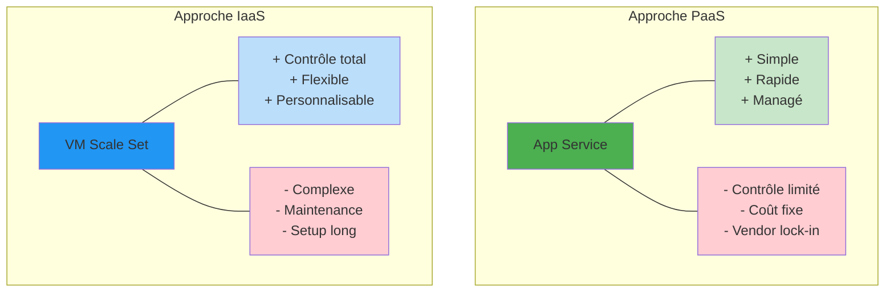
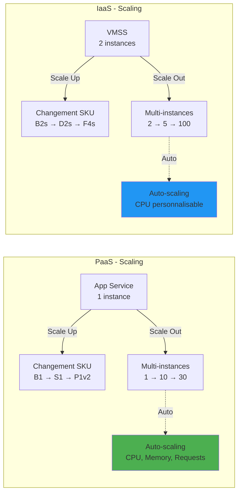
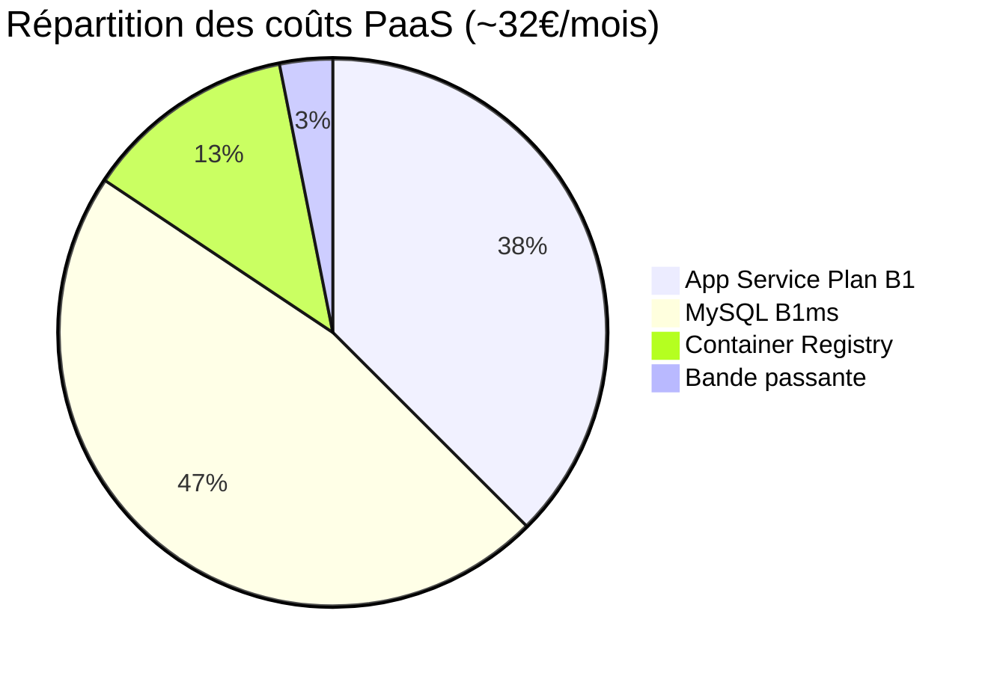
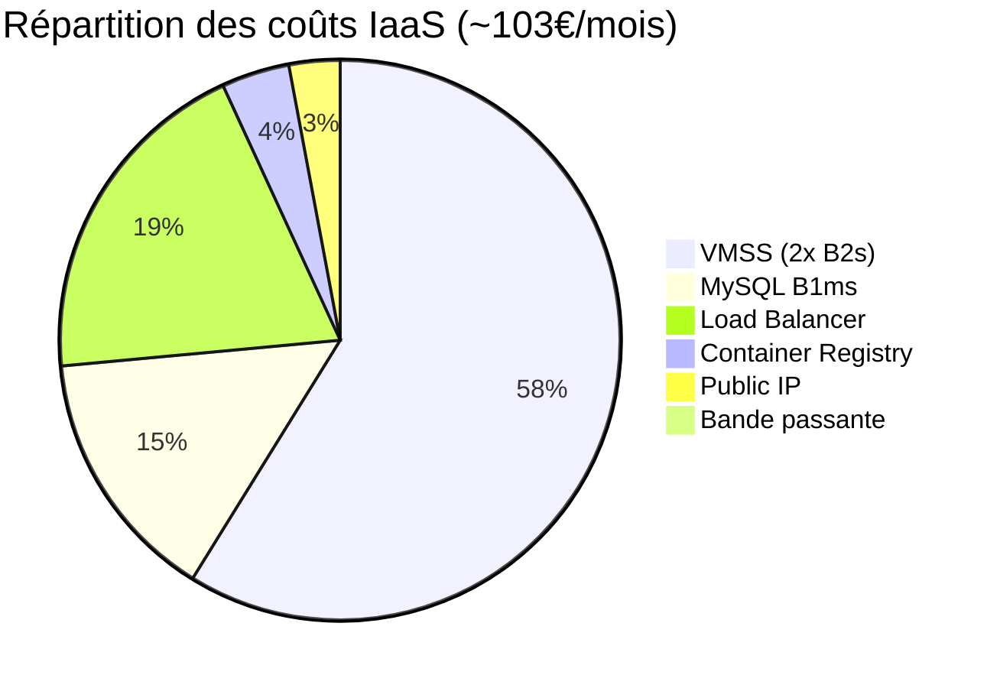
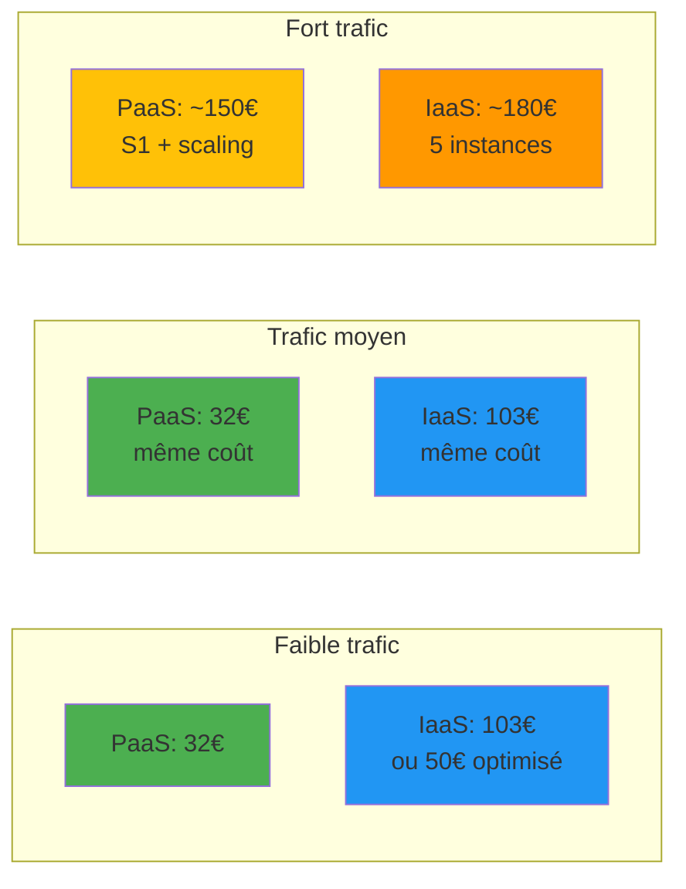
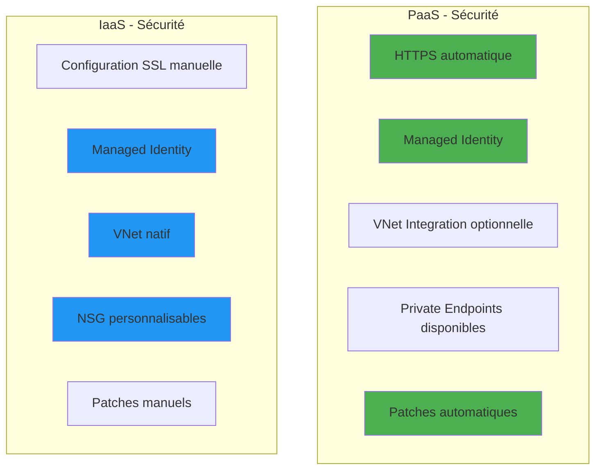
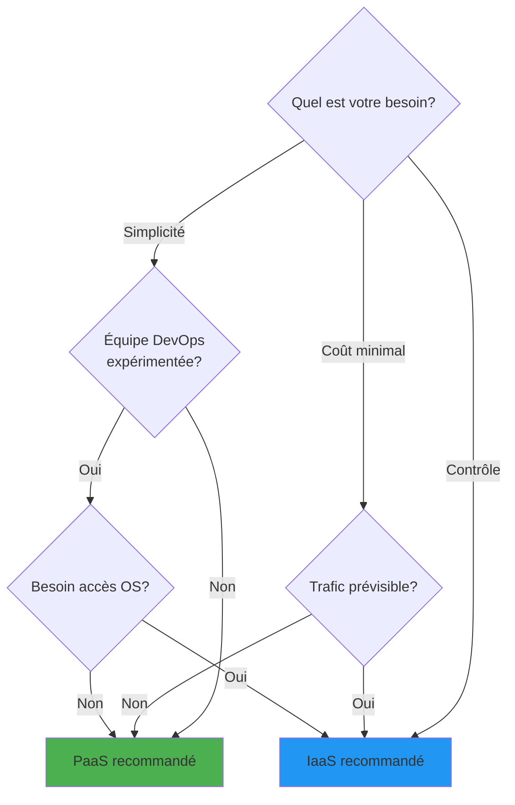
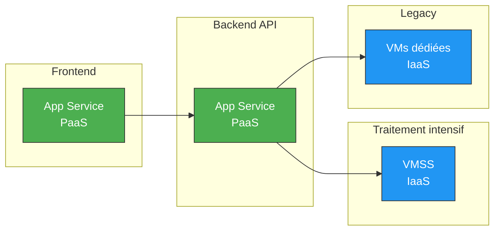

# Comparaison PaaS vs IaaS

## Introduction

Ce document compare en détail les deux approches de déploiement implémentées dans le projet TERRACLOUD : l'approche **PaaS** (Platform as a Service) avec Azure App Service et l'approche **IaaS** (Infrastructure as a Service) avec VM Scale Set.

## Vue d'ensemble comparative



## Comparaison technique détaillée

### Architecture

| Aspect | PaaS | IaaS |
|--------|------|------|
| **Composants principaux** | App Service Plan + Web App | Public IP + Load Balancer + VMSS |
| **Nombre de ressources Azure** | 6 | 12+ |
| **Isolation réseau** | Optionnelle (VNet Integration) | Native (subnet dédié) |
| **Load balancing** | Automatique (multi-instances) | Explicite (Azure Load Balancer) |
| **Accès direct aux serveurs** | Non (SSH limité au conteneur) | Oui (SSH via NAT pool) |

### Déploiement

```mermaid
gantt
    title Temps de déploiement initial
    dateFormat  HH:mm
    axisFormat  %M min

    section PaaS
    Infrastructure Terraform    :a1, 00:00, 10m
    Build & Push Image          :a2, 00:10, 3m
    Vérification                :a3, 00:13, 2m

    section IaaS
    Infrastructure Terraform    :b1, 00:00, 15m
    Build & Push Image          :b2, 00:15, 3m
    Attente cloud-init          :b3, 00:18, 3m
    "Ansible: Docker"           :b4, 00:21, 3m
    "Ansible: Deploy"           :b5, 00:24, 2m
    Vérification                :b6, 00:26, 2m
```



#### Complexité du déploiement

**PaaS:**
```bash
# 3 commandes principales
terraform apply
# L'application est automatiquement déployée
curl https://tc-dev-web-frc-01.azurewebsites.net
```

**IaaS:**
```bash
# 6 étapes principales
terraform apply
sleep 180  # Attente cloud-init
ansible-playbook playbooks/docker-only.yml
ansible-playbook playbooks/deploy-app.yml
curl http://$LB_IP
```

#### Temps de déploiement

| Phase | PaaS | IaaS |
|-------|------|------|
| Infrastructure Terraform | 10-15 min | 15-20 min |
| Configuration serveurs | 0 min (auto) | 5-8 min (Ansible) |
| Déploiement application | Inclus | 5-10 min (Ansible) |
| **Total** | **~15 min** | **~30-35 min** |

### Scalabilité



#### Capacités de scaling

| Critère | PaaS | IaaS |
|---------|------|------|
| **Scaling vertical** | Simple (changement de SKU) | Simple (changement de SKU VM) |
| **Temps de scale up** | < 5 min | < 10 min (redéploiement nécessaire) |
| **Scaling horizontal** | Automatique ou manuel | Automatique ou manuel |
| **Temps de scale out** | 2-3 min (instances warm) | 5-8 min (boot VM + config) |
| **Instances minimum** | 1 (0 possible) | 1 (2 recommandé pour HA) |
| **Instances maximum** | 30 (Premium) | 1000 (limite VMSS) |
| **Auto-scaling natif** | Oui (Standard+) | Oui (configuration Azure Monitor) |
| **Métriques de scaling** | CPU, Mémoire, HTTP Queue, Requests | CPU, Mémoire, Custom Metrics |

#### Configuration d'auto-scaling

**PaaS:**
```bash
# Configuration via Azure Portal ou CLI
az monitor autoscale create \
  --resource-group rg-nan_1 \
  --resource /subscriptions/.../serverfarms/tc-dev-asp-frc-01 \
  --min-count 1 --max-count 10 --count 2
```

**IaaS:**
```hcl
# Configuration via Terraform
resource "azurerm_monitor_autoscale_setting" "vmss" {
  profile {
    capacity {
      minimum = 2
      default = 2
      maximum = 5
    }
    rule {
      metric_trigger {
        metric_name = "Percentage CPU"
        threshold   = 75
      }
      scale_action {
        direction = "Increase"
        value     = "1"
      }
    }
  }
}
```

### Gestion et maintenance

#### Responsabilités

| Tâche | PaaS | IaaS |
|-------|------|------|
| **Patches OS** | Azure | Vous |
| **Mises à jour plateforme** | Azure (automatique) | Vous |
| **Configuration serveur** | Limitée | Totale |
| **Monitoring infrastructure** | Azure (inclus) | À configurer |
| **Gestion des conteneurs** | Azure | Docker (vous) |
| **Backup infrastructure** | Azure | À configurer |
| **Disaster recovery** | Azure (options payantes) | À configurer |
| **Certificats SSL** | Azure (gratuit pour *.azurewebsites.net) | À gérer |

#### Opérations quotidiennes

**PaaS:**
```bash
# Déployer une mise à jour
docker build && docker push
az webapp restart --name tc-dev-web-frc-01 --resource-group rg-nan_1

# Consulter les logs
az webapp log tail --name tc-dev-web-frc-01 --resource-group rg-nan_1

# Scaler
az appservice plan update --sku S1 --number-of-workers 3
```

**IaaS:**
```bash
# Déployer une mise à jour
docker build && docker push
ansible-playbook playbooks/deploy-app.yml

# Consulter les logs
ansible all -m shell -a "docker logs laravel-app" --become

# Scaler
az vmss scale --new-capacity 3
ansible-playbook playbooks/site.yml  # Configurer les nouvelles instances
```

### Coûts

#### Coûts mensuels détaillés (environnement dev)





#### Comparaison détaillée des coûts

| Ressource | PaaS | IaaS | Différence |
|-----------|------|------|------------|
| **Compute** | App Service Plan B1: 12€ | 2x VM B2s: 60€ | +48€ |
| **Load Balancing** | Inclus | LB Standard: 20€ | +20€ |
| **IP Publique** | Inclus | IP Static: 3€ | +3€ |
| **Base de données** | MySQL B1ms: 15€ | MySQL B1ms: 15€ | =0€ |
| **Registry** | ACR Basic: 4€ | ACR Basic: 4€ | =0€ |
| **Bande passante** | ~1€ | ~1€ | =0€ |
| **Total mensuel** | **~32€** | **~103€** | **+71€** |

#### Optimisation des coûts

**PaaS:**
- Utiliser F1 (Free tier) pour dev léger: 0€
- Shared compute pour tests: ~9€
- Arrêt programmé non disponible (toujours facturé)

**IaaS:**
- VMs Spot: -80% (-48€) mais instable
- Arrêt 19:00-08:00 (dev): -40% (-24€)
- Réduire à 1 instance: -50% (-30€)
- Utiliser B1s au lieu de B2s: -50% (-30€)

**IaaS optimisé pour dev:** ~50-60€/mois

#### Évolution des coûts selon le trafic



### Performances

#### Temps de réponse

| Scénario | PaaS | IaaS |
|----------|------|------|
| **Requête simple** | 50-100ms | 50-100ms |
| **Requête avec DB** | 100-200ms | 100-200ms |
| **Cold start** | 3-5s (B1) | N/A (VMs toujours actives) |
| **Après scaling** | 2-3 min (instances warm) | 5-8 min (boot + config) |

#### Throughput

**PaaS (B1):**
- 1 instance: ~500-1000 req/min
- 3 instances: ~1500-3000 req/min

**IaaS (2x B2s):**
- 2 instances: ~1000-2000 req/min
- 5 instances: ~2500-5000 req/min

### Sécurité



#### Comparaison des aspects sécurité

| Aspect | PaaS | IaaS |
|--------|------|------|
| **SSL/TLS** | Certificat gratuit automatique | Configuration manuelle requise |
| **Firewall applicatif** | Disponible (WAF sur Premium) | Configuration manuelle |
| **Isolation réseau** | VNet Integration (Standard+) | NSG + subnet dédié natif |
| **Accès SSH** | Limité (conteneur seulement) | Complet (via NAT pool) |
| **Identités managées** | Oui, natif | Oui, natif |
| **Conformité** | Certifications Azure | Vous gérez la conformité |
| **Audit logs** | Azure Monitor intégré | À configurer |
| **Patches de sécurité** | Automatiques | Manuels (ou automatisables) |
| **DDoS Protection** | Basic inclus | Basic inclus |

### Flexibilité et contrôle

#### Niveau de contrôle

| Domaine | PaaS | IaaS |
|---------|------|------|
| **Choix de l'OS** | Linux ou Windows (limité) | N'importe quel OS |
| **Configuration OS** | Non accessible | Totale |
| **Runtime applicatif** | Stacks supportés seulement | Tout |
| **Packages système** | Limité aux conteneurs | Installation libre |
| **Configuration réseau** | Basique | Avancée (routes, VPN, etc.) |
| **Logging personnalisé** | Via conteneur | Total |
| **Monitoring** | Azure Monitor | Au choix |

#### Cas d'usage spécifiques

**PaaS convient pour:**
- Applications web standards (Node.js, PHP, .NET, Python)
- APIs RESTful
- Applications conteneurisées
- Prototypes et MVPs
- Applications SaaS simples

**IaaS nécessaire pour:**
- Applications legacy avec dépendances OS spécifiques
- Workloads nécessitant packages système particuliers
- Besoin de contrôle fin sur le réseau
- Debugging approfondi requis
- Conformité réglementaire stricte nécessitant accès OS

### Monitoring et observabilité

#### Outils et capacités

| Fonctionnalité | PaaS | IaaS |
|----------------|------|------|
| **Logs applicatifs** | Azure Monitor intégré | À configurer (ELK, Splunk, etc.) |
| **Métriques infrastructure** | Automatique | Azure Monitor + agents |
| **Application Insights** | Intégration facile | Configuration manuelle |
| **Alertes** | Azure Monitor | Azure Monitor ou custom |
| **Dashboards** | Azure Portal | À créer (Grafana, etc.) |
| **Distributed tracing** | Application Insights | À implémenter |

### Disaster Recovery et High Availability

#### Capacités de résilience

| Aspect | PaaS | IaaS |
|--------|------|------|
| **Multi-region** | Géré avec Traffic Manager | VMSS multi-region + Traffic Manager |
| **Backup applicatif** | Backup slots (Standard+) | À configurer (snapshots, etc.) |
| **RTO (Recovery Time)** | < 5 min | 10-30 min (selon config) |
| **RPO (Recovery Point)** | Dernière config | Selon fréquence backup |
| **Availability SLA** | 99.95% (Standard+) | 99.95% (2+ zones) |

## Décision: Quand choisir PaaS ou IaaS?

### Matrice de décision



### Recommandations par critère

#### Choisir PaaS si:

1. **Équipe réduite** ou sans expertise DevOps avancée
2. **Time-to-market** est critique
3. **Application standard** (web app, API REST)
4. **Budget limité** pour un projet de petite envergure
5. **Maintenance minimale** souhaitée
6. **Scaling automatique** requis sans complexité
7. **Prototype** ou environnement de développement

**Exemple type:** Startup développant un SaaS, équipe de 2-3 développeurs.

#### Choisir IaaS si:

1. **Contrôle total** sur l'infrastructure requis
2. **Configuration OS spécifique** nécessaire
3. **Application legacy** avec dépendances complexes
4. **Conformité** réglementaire nécessitant accès complet
5. **Debugging approfondi** fréquemment requis
6. **Optimisation coûts** à grande échelle (100+ instances)
7. **Environnement hybride** (cloud + on-premise)

**Exemple type:** Entreprise avec équipe DevOps, application existante à migrer.

### Tableau de scoring

Évaluez votre projet (1-5 pour chaque critère):

| Critère | Poids | Score PaaS | Score IaaS |
|---------|-------|-----------|-----------|
| Simplicité nécessaire | 20% | 5/5 | 2/5 |
| Budget disponible | 15% | 5/5 | 3/5 |
| Expertise technique | 15% | 3/5 | 5/5 |
| Contrôle requis | 15% | 2/5 | 5/5 |
| Time-to-market | 10% | 5/5 | 3/5 |
| Flexibilité nécessaire | 10% | 3/5 | 5/5 |
| Maintenance souhaitée | 10% | 5/5 | 2/5 |
| Scalabilité requise | 5% | 4/5 | 4/5 |

**Score pondéré:**
- **PaaS**: 4.0/5 → Recommandé pour projets simples/standards
- **IaaS**: 3.6/5 → Recommandé pour projets complexes/spécifiques

## Approche hybride

Il est possible de combiner les deux approches:



**Cas d'usage hybride:**
- Frontend en PaaS (simple, scaling automatique)
- API principale en PaaS (standard)
- Jobs batch/ML en IaaS (ressources spécifiques)
- Services legacy en IaaS (dépendances OS)

## Migration PaaS → IaaS ou IaaS → PaaS

### Migrer de PaaS vers IaaS

**Raisons courantes:**
- Besoin de contrôle accru
- Configuration OS spécifique requise
- Optimisation des coûts à grande échelle
- Compliance stricte

**Étapes:**
1. Déployer l'infrastructure IaaS
2. Réutiliser la même image Docker (ACR)
3. Configurer Ansible
4. Tester en parallèle
5. Basculer le trafic (DNS ou Traffic Manager)

### Migrer de IaaS vers PaaS

**Raisons courantes:**
- Réduire la complexité
- Réduire l'équipe DevOps
- Améliorer le time-to-market
- Simplifier la maintenance

**Étapes:**
1. Vérifier compatibilité (runtime, dépendances)
2. Déployer App Service
3. Réutiliser la même image Docker (ACR)
4. Tester en parallèle
5. Basculer le trafic

## Conclusion

### Résumé des différences clés

| Aspect | PaaS | IaaS |
|--------|------|------|
| **Philosophie** | Abstraction maximale | Contrôle maximal |
| **Complexité** | Faible | Élevée |
| **Temps de setup** | ~15 min | ~35 min |
| **Coût (dev)** | ~32€/mois | ~103€/mois |
| **Maintenance** | Minimale | Importante |
| **Scalabilité** | Automatique | Configurable |
| **Cas d'usage** | Applications standards | Applications spécifiques |

### Recommandation générale pour TERRACLOUD

Pour un projet étudiant comme TERRACLOUD:

- **Phase de développement**: **PaaS recommandé**
  - Setup rapide
  - Coûts réduits
  - Focus sur l'application, pas l'infrastructure

- **Phase de production (si réel)**: **Évaluer selon le trafic**
  - Faible trafic (<1000 users): PaaS
  - Trafic élevé (>10000 users): IaaS ou hybride
  - Besoins spécifiques: IaaS

- **Apprentissage**: **Les deux!**
  - PaaS pour comprendre les services managés
  - IaaS pour maîtriser l'infrastructure complète

## Documents connexes

- [Architecture PaaS](../architecture/architecture-paas.md) - Détails techniques PaaS
- [Architecture IaaS](../architecture/architecture-iaas.md) - Détails techniques IaaS
- [Guide de déploiement PaaS](deployment-paas.md) - Procédure PaaS
- [Guide de déploiement IaaS](deployment-iaas.md) - Procédure IaaS
- [Vue d'ensemble](../architecture/overview.md) - Architecture générale

