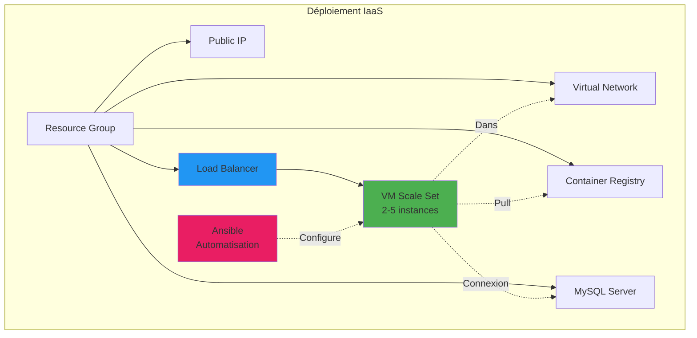
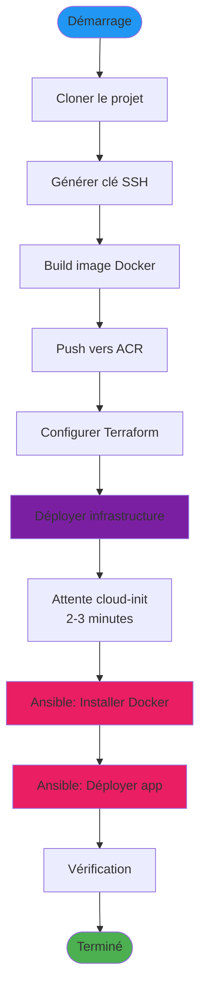
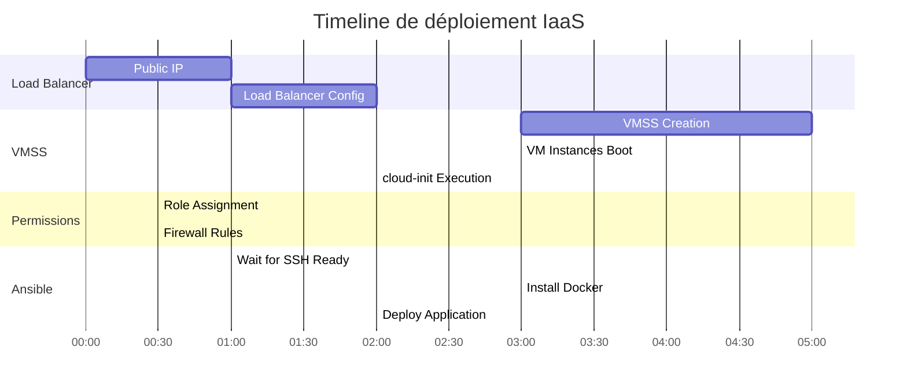
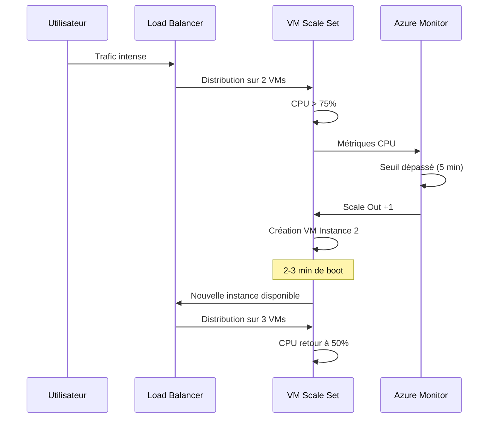
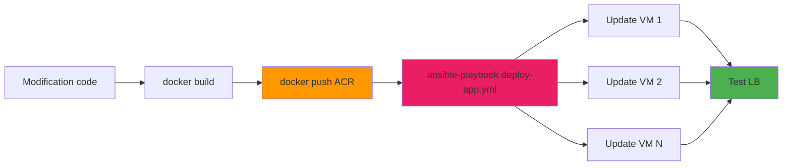

# Guide de déploiement IaaS - VM Scale Set avec Load Balancer

## Introduction

Ce guide détaille le déploiement d'une application Laravel conteneurisée sur Azure en utilisant l'approche **IaaS (Infrastructure as a Service)** avec VM Scale Set, Load Balancer, Docker et automatisation Ansible.

## Architecture déployée



## Prérequis

### Logiciels requis

| Outil | Version minimale | Installation |
|-------|-----------------|--------------|
| Azure CLI | 2.40+ | [Documentation](https://learn.microsoft.com/fr-fr/cli/azure/install-azure-cli) |
| Terraform | 1.0+ | [Documentation](https://developer.hashicorp.com/terraform/downloads) |
| Ansible | 2.9+ | `pip3 install ansible` |
| Docker | 20.10+ | [Documentation](https://docs.docker.com/get-docker/) |
| Git | 2.30+ | `apt install git` ou équivalent |

### Vérification des prérequis

```bash
# Vérifier les versions
az --version
terraform --version
ansible --version
docker --version
git --version
```

### Installation d'Ansible et collections Azure

```bash
# Installer Ansible
sudo apt update
sudo apt install -y python3-pip
pip3 install ansible

# Installer la collection Azure pour Ansible
ansible-galaxy collection install azure.azcollection

# Installer les dépendances Python Azure
pip3 install -r ~/.ansible/collections/ansible_collections/azure/azcollection/requirements-azure.txt
```

### Génération de clé SSH

```bash
# Générer une paire de clés pour l'environnement dev
ssh-keygen -t ed25519 -f ~/.ssh/terracloud-dev-key -C "terracloud-dev-vmss"

# Afficher la clé publique (à copier)
cat ~/.ssh/terracloud-dev-key.pub

# Pour l'environnement prod
ssh-keygen -t ed25519 -f ~/.ssh/terracloud-prod-key -C "terracloud-prod-vmss"
```

### Accès Azure

- **Tenant**: Epitech
- **Subscription ID**: `6b9318b1-2215-418a-b0fd-ba0832e9b333`
- **Resource Group**: `rg-nan_1` (existant)
- **Région**: France Central (`francecentral`)

### Connexion à Azure

```bash
# Se connecter
az login

# Définir la subscription
az account set --subscription "6b9318b1-2215-418a-b0fd-ba0832e9b333"

# Vérifier la connexion
az account show --output table
```

## Étapes de déploiement

### Flux de déploiement complet



### Étape 1: Préparer l'image Docker

Avant de déployer l'infrastructure, il faut construire et pousser l'image Docker vers ACR.

```bash
# Se positionner dans le projet
cd T-CLO-900

# Se connecter à ACR (l'infrastructure partagée doit exister)
az acr login --name tcdevacrfrc01

# Construire l'image
cd sample-app-master/
docker build -t tcdevacrfrc01.azurecr.io/sample-app:latest .

# Pousser l'image
docker push tcdevacrfrc01.azurecr.io/sample-app:latest

# Vérifier
az acr repository show-tags --name tcdevacrfrc01 --repository sample-app

# Revenir à la racine
cd ..
```

### Étape 2: Configurer Terraform

```bash
# Se positionner dans l'environnement souhaité
cd terraform/envs/dev  # ou prod

# Copier le fichier d'exemple
cp terraform.tfvars.example terraform.tfvars

# Éditer les variables
nano terraform.tfvars
```

Configuration dans `terraform.tfvars`:

```hcl
# Obligatoire
mysql_admin_password  = "VotreMotDePasseSecurise123!"
ssh_public_key_iaas   = "ssh-ed25519 AAAAC3Nza... votre-email@exemple.com"

# Optionnel (valeurs par défaut disponibles)
environment = "dev"
location    = "francecentral"
vm_sku      = "Standard_B2s"
```

Ou via variable d'environnement:

```bash
# Exporter la clé SSH
export TF_VAR_ssh_public_key_iaas="$(cat ~/.ssh/terracloud-dev-key.pub)"
```

### Étape 3: Initialiser Terraform

```bash
# Initialiser
terraform init

# Valider la configuration
terraform validate
```

### Étape 4: Déployer l'infrastructure partagée (si nécessaire)

Si l'infrastructure partagée (VNet, ACR, MySQL) n'existe pas encore:

```bash
terraform apply -target=module.rg \
                -target=module.network \
                -target=module.acr \
                -target=module.mysql
```

### Étape 5: Planifier le déploiement IaaS

```bash
terraform plan -target=module.loadbalancer \
               -target=module.vmss \
               -target=azurerm_role_assignment.vmss_acr_pull \
               -target=azurerm_mysql_flexible_server_firewall_rule.vmss_to_mysql
```

Ressources qui seront créées:

| Ressource | Description | Temps estimé |
|-----------|-------------|--------------|
| Public IP | IP statique pour le LB | 1 min |
| Load Balancer | LB Standard avec règles | 2 min |
| VM Scale Set | 2 instances Ubuntu 22.04 | 5-8 min |
| Auto-scaling | Profil et règles | 1 min |
| Role Assignment | AcrPull pour VMSS | 30s |
| Firewall Rule | MySQL pour VMSS | 30s |

**Temps total estimé**: ~15-20 minutes

### Étape 6: Déployer l'infrastructure IaaS

```bash
terraform apply -target=module.loadbalancer \
                -target=module.vmss \
                -target=azurerm_role_assignment.vmss_acr_pull \
                -target=azurerm_mysql_flexible_server_firewall_rule.vmss_to_mysql
```

Tapez `yes` pour confirmer.



### Étape 7: Récupérer l'IP du Load Balancer

```bash
# Afficher les outputs
terraform output

# Récupérer l'IP publique
LB_IP=$(terraform output -raw iaas_load_balancer_ip)
echo "Load Balancer IP: $LB_IP"

# Sauvegarder pour usage ultérieur
echo $LB_IP > /tmp/lb_ip.txt
```

### Étape 8: Attendre l'initialisation des VMs

Les VMs utilisent cloud-init pour leur configuration initiale. Attendre 2-3 minutes.

```bash
# Vérifier le statut des instances VMSS
az vmss list-instances \
  --name tc-dev-vmss-frc-01 \
  --resource-group rg-nan_1 \
  --output table

# Attendre que toutes les instances soient "Running"
watch -n 10 'az vmss list-instances --name tc-dev-vmss-frc-01 --resource-group rg-nan_1 --output table'
```

### Étape 9: Configurer Ansible

```bash
# Se positionner dans le dossier Ansible
cd ../../../ansible

# Vérifier l'inventaire dynamique Azure
ansible-inventory -i inventory/azure_rm.yml --graph

# Tester la connectivité
ansible all -i inventory/azure_rm.yml -m ping
```

Si la connectivité échoue, attendre quelques minutes supplémentaires pour que les VMs terminent leur initialisation.

### Étape 10: Installer Docker avec Ansible

```bash
# Exécuter le playbook d'installation Docker
ansible-playbook -i inventory/azure_rm.yml playbooks/docker-only.yml

# Vérifier l'installation
ansible all -i inventory/azure_rm.yml -m shell -a "docker --version" --become
```

Sortie attendue:
```
10.0.3.4 | SUCCESS | rc=0 >>
Docker version 24.0.x, build xxxxx

10.0.3.5 | SUCCESS | rc=0 >>
Docker version 24.0.x, build xxxxx
```

### Étape 11: Déployer l'application

```bash
# Déployer l'application Laravel sur toutes les VMs
ansible-playbook -i inventory/azure_rm.yml playbooks/deploy-app.yml
```

Le playbook effectue:
1. Connexion à ACR via identité managée
2. Pull de l'image Docker
3. Arrêt de l'ancien conteneur (si existant)
4. Démarrage du nouveau conteneur avec variables d'environnement
5. Exécution des migrations Laravel
6. Vérification de la santé du conteneur

### Étape 12: Vérification

```bash
# Tester l'accès via le Load Balancer
curl http://$LB_IP

# Test avec détails
curl -v http://$LB_IP

# Vérifier que les requêtes sont distribuées entre les instances
for i in {1..10}; do
  curl -s http://$LB_IP | grep -o "Laravel"
  sleep 1
done
```

Réponse attendue:
```html
<!DOCTYPE html>
<html>
...
Laravel Application
...
</html>
```

### Étape 13: Ouvrir dans le navigateur

```bash
# Linux
xdg-open http://$LB_IP

# macOS
open http://$LB_IP

# Windows WSL
cmd.exe /c start http://$LB_IP
```

## Test de l'auto-scaling

### Scénario de montée en charge



### Tester le scale-out

```bash
# SSH dans une VM via le Load Balancer
ssh -i ~/.ssh/terracloud-dev-key azureuser@$LB_IP -p 50000

# Générer de la charge CPU
sudo apt install -y stress
stress --cpu 4 --timeout 600

# Dans un autre terminal, observer le scaling
watch -n 30 'az vmss list-instances --name tc-dev-vmss-frc-01 --resource-group rg-nan_1 --output table'
```

Après ~5 minutes de CPU > 75%, une nouvelle instance devrait être créée.

### Voir l'historique d'auto-scaling

```bash
# Voir les événements de scaling
az monitor activity-log list \
  --resource-group rg-nan_1 \
  --offset 2h \
  --query "[?contains(operationName.value, 'Scale')]" \
  --output table
```

## Opérations courantes

### Accès SSH aux VMs

```bash
# SSH vers instance 0 (port 50000)
ssh -i ~/.ssh/terracloud-dev-key azureuser@$LB_IP -p 50000

# SSH vers instance 1 (port 50001)
ssh -i ~/.ssh/terracloud-dev-key azureuser@$LB_IP -p 50001

# SSH vers instance N (port 5000N)
ssh -i ~/.ssh/terracloud-dev-key azureuser@$LB_IP -p 5000N
```

### Consulter les logs de l'application

```bash
# Via Ansible (tous les serveurs)
ansible all -i inventory/azure_rm.yml \
  -m shell -a "docker logs laravel-app --tail 50" \
  --become

# Via SSH (sur une VM spécifique)
ssh -i ~/.ssh/terracloud-dev-key azureuser@$LB_IP -p 50000
sudo docker logs laravel-app -f
```

### Vérifier l'état des conteneurs

```bash
# Via Ansible
ansible all -i inventory/azure_rm.yml \
  -m shell -a "docker ps" \
  --become

# Vérifier les conteneurs arrêtés
ansible all -i inventory/azure_rm.yml \
  -m shell -a "docker ps -a" \
  --become
```

### Mettre à jour l'application



```bash
# 1. Modifier le code
cd sample-app-master/
# ... vos modifications ...

# 2. Rebuild et push
az acr login --name tcdevacrfrc01
docker build -t tcdevacrfrc01.azurecr.io/sample-app:latest .
docker push tcdevacrfrc01.azurecr.io/sample-app:latest

# 3. Redéployer avec Ansible
cd ../ansible
ansible-playbook -i inventory/azure_rm.yml playbooks/deploy-app.yml

# 4. Vérifier
curl http://$LB_IP
```

### Déploiement en rolling update

Pour éviter l'interruption de service:

```bash
# Déployer instance par instance
ansible-playbook -i inventory/azure_rm.yml \
  playbooks/deploy-app.yml \
  --serial 1

# Ou déployer 50% à la fois
ansible-playbook -i inventory/azure_rm.yml \
  playbooks/deploy-app.yml \
  --serial 50%
```

### Scaling manuel

```bash
# Scaler à 3 instances
az vmss scale \
  --name tc-dev-vmss-frc-01 \
  --resource-group rg-nan_1 \
  --new-capacity 3

# Attendre que les nouvelles instances soient prêtes
az vmss list-instances \
  --name tc-dev-vmss-frc-01 \
  --resource-group rg-nan_1 \
  --output table

# Déployer l'application sur les nouvelles instances
cd ansible
ansible-playbook -i inventory/azure_rm.yml playbooks/site.yml
```

## Dépannage

### Les VMs ne sont pas accessibles via SSH

#### Symptôme
```bash
ansible all -i inventory/azure_rm.yml -m ping
# Connection timeout
```

#### Diagnostic

```bash
# Vérifier que les VMs sont en cours d'exécution
az vmss list-instances \
  --name tc-dev-vmss-frc-01 \
  --resource-group rg-nan_1 \
  --output table

# Vérifier les NSG rules
az network nsg rule list \
  --nsg-name nsg-vmss \
  --resource-group rg-nan_1 \
  --output table

# Tester la connectivité directe
ssh -i ~/.ssh/terracloud-dev-key azureuser@$LB_IP -p 50000 -v
```

#### Solutions

1. **Attendre l'initialisation cloud-init** (2-3 minutes après création)

2. **Vérifier la clé SSH**
   ```bash
   # Vérifier que la bonne clé est utilisée
   ssh-add -l
   
   # Vérifier les permissions
   chmod 600 ~/.ssh/terracloud-dev-key
   ```

3. **Vérifier le NSG**
   ```bash
   # S'assurer que le port 22 est ouvert depuis le LB
   az network nsg rule show \
     --nsg-name nsg-vmss \
     --resource-group rg-nan_1 \
     --name Allow-SSH-From-LB
   ```

### Docker n'est pas installé sur les VMs

#### Symptôme
```bash
ansible all -i inventory/azure_rm.yml -m shell -a "docker --version"
# docker: command not found
```

#### Solution

```bash
# Réexécuter le playbook Docker
ansible-playbook -i inventory/azure_rm.yml playbooks/docker-only.yml

# Si l'erreur persiste, vérifier manuellement
ssh -i ~/.ssh/terracloud-dev-key azureuser@$LB_IP -p 50000
sudo apt update
sudo apt install -y docker.io
sudo systemctl start docker
sudo systemctl enable docker
sudo usermod -aG docker azureuser
```

### Impossible de pull l'image depuis ACR

#### Symptôme
```
Error: Failed to pull image from ACR
```

#### Diagnostic

```bash
# Vérifier l'identité managée du VMSS
az vmss identity show \
  --name tc-dev-vmss-frc-01 \
  --resource-group rg-nan_1

# Vérifier le role assignment
VMSS_PRINCIPAL=$(az vmss identity show \
  --name tc-dev-vmss-frc-01 \
  --resource-group rg-nan_1 \
  --query principalId -o tsv)

az role assignment list --assignee $VMSS_PRINCIPAL --output table
```

#### Solution

```bash
# SSH dans une VM
ssh -i ~/.ssh/terracloud-dev-key azureuser@$LB_IP -p 50000

# Tester la connexion ACR avec l'identité managée
az login --identity
az acr login --name tcdevacrfrc01

# Pull manuel de l'image
sudo docker pull tcdevacrfrc01.azurecr.io/sample-app:latest
```

Si l'erreur persiste:

```bash
# Recréer le role assignment
cd terraform/envs/dev
terraform apply -target=azurerm_role_assignment.vmss_acr_pull
```

### L'application ne répond pas via le Load Balancer

#### Symptôme
```bash
curl http://$LB_IP
# Connection timeout
```

#### Diagnostic

```bash
# Vérifier le health probe
az network lb probe show \
  --name http-probe \
  --lb-name tc-dev-lb-frc-01 \
  --resource-group rg-nan_1

# Vérifier le backend pool
az network lb address-pool show \
  --name vmss-backend-pool \
  --lb-name tc-dev-lb-frc-01 \
  --resource-group rg-nan_1

# Tester localement sur une VM
ssh -i ~/.ssh/terracloud-dev-key azureuser@$LB_IP -p 50000
curl http://localhost:80
```

#### Solutions

1. **Le conteneur n'est pas démarré**
   ```bash
   # Vérifier via Ansible
   ansible all -i inventory/azure_rm.yml \
     -m shell -a "docker ps" \
     --become
   
   # Redéployer si nécessaire
   ansible-playbook -i inventory/azure_rm.yml playbooks/deploy-app.yml
   ```

2. **Health probe échoue**
   ```bash
   # SSH dans une VM
   ssh -i ~/.ssh/terracloud-dev-key azureuser@$LB_IP -p 50000
   
   # Vérifier les logs du conteneur
   sudo docker logs laravel-app
   
   # Tester le endpoint de health
   curl -v http://localhost:80/
   ```

3. **Règle de load balancing incorrecte**
   ```bash
   # Vérifier les règles
   az network lb rule list \
     --lb-name tc-dev-lb-frc-01 \
     --resource-group rg-nan_1 \
     --output table
   ```

### Erreur de connexion MySQL

#### Symptôme
```
SQLSTATE[HY000] [2002] Connection refused
```

#### Solutions

```bash
# Vérifier les firewall rules MySQL
az mysql flexible-server firewall-rule list \
  --name tc-dev-mysql-frc-01 \
  --resource-group rg-nan_1 \
  --output table

# Vérifier que le subnet VMSS est autorisé
az mysql flexible-server firewall-rule show \
  --name AllowVMSSSubnet \
  --resource-group rg-nan_1 \
  --server-name tc-dev-mysql-frc-01

# Tester depuis une VM
ssh -i ~/.ssh/terracloud-dev-key azureuser@$LB_IP -p 50000
mysql -h tc-dev-mysql-frc-01.mysql.database.azure.com -u app_admin -p
```

### L'auto-scaling ne fonctionne pas

#### Diagnostic

```bash
# Vérifier la configuration d'auto-scaling
az monitor autoscale show \
  --name tc-dev-vmss-frc-01-autoscale \
  --resource-group rg-nan_1

# Vérifier les métriques CPU actuelles
az monitor metrics list \
  --resource $(az vmss show --name tc-dev-vmss-frc-01 --resource-group rg-nan_1 --query id -o tsv) \
  --metric "Percentage CPU" \
  --start-time $(date -u -d '1 hour ago' '+%Y-%m-%dT%H:%M:%SZ')
```

#### Solutions

1. **Le seuil n'est pas atteint assez longtemps** (5 minutes requis)
2. **Cooldown période** (5 minutes entre chaque scaling)
3. **Limites atteintes** (min: 2, max: 5)

## Configuration avancée

### Configurer les alertes

```bash
# Créer une alerte pour haute utilisation CPU
az monitor metrics alert create \
  --name vmss-high-cpu \
  --resource-group rg-nan_1 \
  --scopes $(az vmss show --name tc-dev-vmss-frc-01 --resource-group rg-nan_1 --query id -o tsv) \
  --condition "avg Percentage CPU > 80" \
  --window-size 5m \
  --evaluation-frequency 1m \
  --action email your-email@example.com
```

### Configurer un webhook pour déploiement automatique

```bash
# Dans le playbook Ansible, ajouter un handler
# qui se déclenche automatiquement lors du scale-out
```

### Backup automatique de la base de données

```bash
# SSH dans une VM
ssh -i ~/.ssh/terracloud-dev-key azureuser@$LB_IP -p 50000

# Créer un script de backup
cat > /home/azureuser/backup-db.sh << 'EOF'
#!/bin/bash
DATE=$(date +%Y%m%d_%H%M%S)
mysqldump -h tc-dev-mysql-frc-01.mysql.database.azure.com \
          -u app_admin -p$DB_PASSWORD \
          app_database > /tmp/backup_$DATE.sql
EOF

chmod +x /home/azureuser/backup-db.sh

# Ajouter au cron
crontab -e
# Ajouter: 0 2 * * * /home/azureuser/backup-db.sh
```

## Nettoyage

### Supprimer uniquement l'IaaS

```bash
cd terraform/envs/dev

# Détruire VMSS et Load Balancer
terraform destroy -target=module.vmss \
                  -target=module.loadbalancer \
                  -target=azurerm_role_assignment.vmss_acr_pull \
                  -target=azurerm_mysql_flexible_server_firewall_rule.vmss_to_mysql
```

Temps estimé: 5-8 minutes

### Supprimer toute l'infrastructure

```bash
# Détruire tout
terraform destroy

# Confirmer avec 'yes'
```

**Attention**: Cela supprime également ACR et MySQL (partagés avec PaaS).

## Checklist de déploiement

- [ ] Prérequis installés (Azure CLI, Terraform, Ansible, Docker)
- [ ] Clé SSH générée
- [ ] Connexion Azure établie
- [ ] Image Docker construite et poussée vers ACR
- [ ] Variables Terraform configurées
- [ ] Infrastructure Terraform déployée
- [ ] IP du Load Balancer récupérée
- [ ] Instances VMSS démarrées et accessibles
- [ ] Docker installé via Ansible
- [ ] Application déployée via Ansible
- [ ] Application accessible via Load Balancer
- [ ] Health probes fonctionnels
- [ ] Auto-scaling configuré et testé

## Coûts estimés

| Ressource | Configuration | Coût mensuel (EUR) |
|-----------|--------------|-------------------|
| VMSS | 2x B2s | ~60 |
| Load Balancer | Standard | ~20 |
| Public IP | Static | ~3 |
| MySQL Flexible Server | B_Standard_B1ms | ~15 |
| Container Registry | Basic | ~4 |
| Bande passante | ~10 GB | ~1 |
| **Total** | | **~103** |

Économies possibles:
- Shutdown 19:00-08:00 (dev): -40% sur VMSS
- Réduction à 1 instance min: -50% sur VMSS

## Prochaines étapes

- [Comparer avec PaaS](comparison.md) - Voir les différences
- [Architecture IaaS](../architecture/architecture-iaas.md) - Détails architecturaux
- [Optimisation des coûts](#) - Réduire les dépenses
- [CI/CD avec Ansible](#) - Automatisation complète

## Support

- [Documentation Azure VMSS](https://learn.microsoft.com/fr-fr/azure/virtual-machine-scale-sets/)
- [Documentation Ansible](https://docs.ansible.com/)
- [Documentation Terraform Azure](https://registry.terraform.io/providers/hashicorp/azurerm/latest/docs)
- [Forum Epitech T-CLO-900](#)

