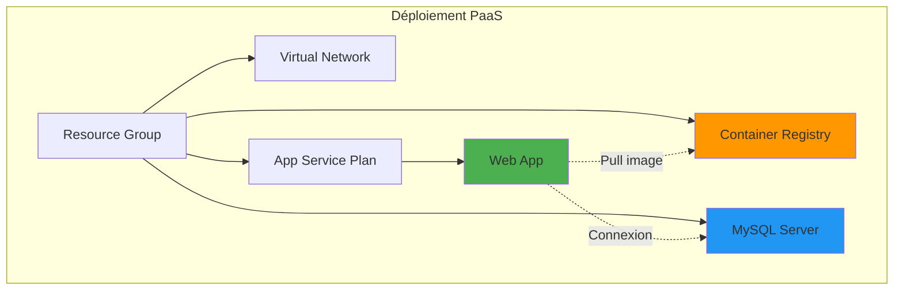
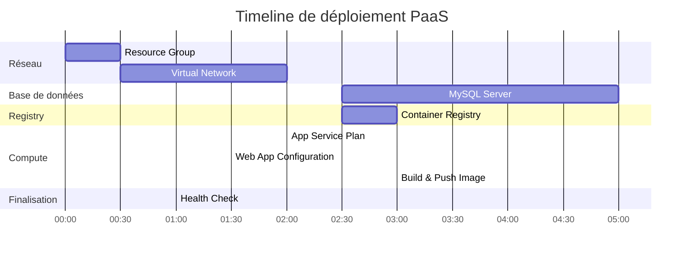
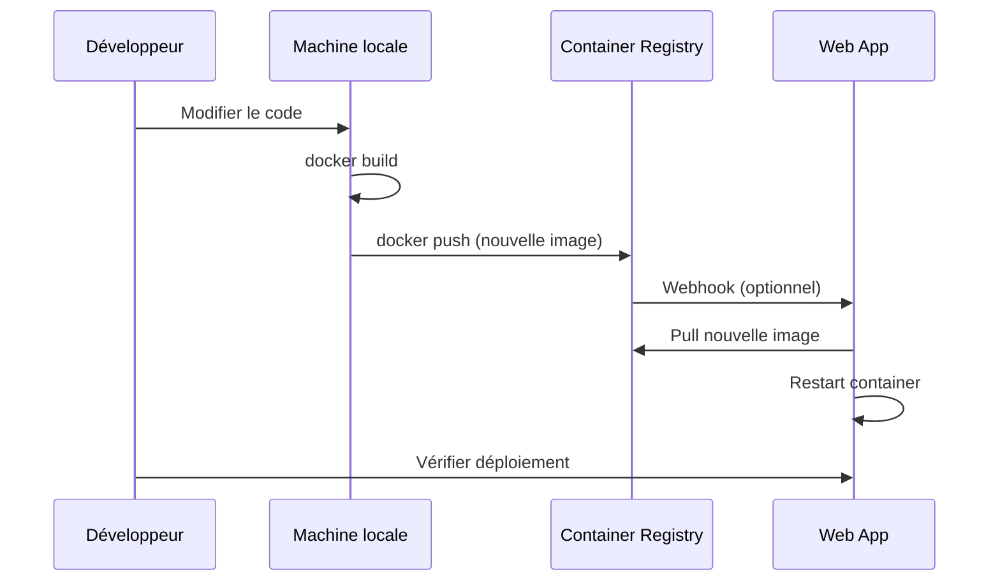

# Guide de déploiement PaaS - Azure App Service

## Introduction

Ce guide détaille le déploiement d'une application Laravel conteneurisée sur Azure en utilisant l'approche **PaaS (Platform as a Service)** avec Azure App Service et Azure Container Registry.

## Architecture déployée



## Prérequis

### Logiciels requis

| Outil | Version minimale | Installation |
|-------|-----------------|--------------|
| Azure CLI | 2.40+ | [Documentation](https://learn.microsoft.com/fr-fr/cli/azure/install-azure-cli) |
| Terraform | 1.0+ | [Documentation](https://developer.hashicorp.com/terraform/downloads) |
| Docker | 20.10+ | [Documentation](https://docs.docker.com/get-docker/) |
| Git | 2.30+ | `apt install git` ou équivalent |

### Vérification des prérequis

```bash
# Vérifier les versions
az --version
terraform --version
docker --version
git --version
```

### Accès Azure

- **Tenant**: Epitech
- **Subscription ID**: `6b9318b1-2215-418a-b0fd-ba0832e9b333`
- **Resource Group**: `rg-nan_1` (existant)
- **Région**: France Central (`francecentral`)

### Connexion à Azure

```bash
# Se connecter
az login

# Définir la subscription
az account set --subscription "6b9318b1-2215-418a-b0fd-ba0832e9b333"

# Vérifier la connexion
az account show
```

## Étapes de déploiement

### Flux de déploiement


### 1. Cloner le projet

```bash
# Cloner le dépôt
git clone https://github.com/Epitech-NSA/t-clo-axel
cd t-clo-axel
```

### 2. Configurer les variables

```bash
# Se positionner dans l'environnement souhaité
cd terraform/envs/dev  # ou prod

# Copier le fichier d'exemple
cp terraform.tfvars.example terraform.tfvars

# Éditer les variables
nano terraform.tfvars
```

Configuration minimale requise dans `terraform.tfvars`:

```hcl
# Obligatoire
mysql_admin_password = "VotreMotDePasseSecurise123!"

# Optionnel (valeurs par défaut disponibles)
environment = "dev"
location    = "francecentral"
```

### 3. Initialiser Terraform

```bash
# Initialiser le backend et les providers
terraform init
```

Cette commande:
- Télécharge le provider Azure
- Initialise le backend de state Terraform
- Prépare les modules

### 4. Planifier le déploiement

```bash
# Voir ce qui sera créé (infrastructure partagée + PaaS)
terraform plan -target=module.rg \
               -target=module.network \
               -target=module.acr \
               -target=module.mysql \
               -target=module.appservice
```

Ressources qui seront créées:

| Module | Ressources | Temps estimé |
|--------|-----------|--------------|
| `module.rg` | Resource Group | 30s |
| `module.network` | VNet, Subnets, NSGs | 2 min |
| `module.acr` | Container Registry | 3 min |
| `module.mysql` | MySQL Flexible Server + DB | 5 min |
| `module.appservice` | App Service Plan + Web App | 3 min |

**Temps total estimé**: ~15 minutes

### 5. Appliquer l'infrastructure

```bash
# Déployer toute l'infrastructure PaaS
terraform apply -target=module.rg \
                -target=module.network \
                -target=module.acr \
                -target=module.mysql \
                -target=module.appservice
```

Tapez `yes` pour confirmer le déploiement.



### 6. Récupérer les outputs

Une fois le déploiement terminé:

```bash
# Afficher tous les outputs
terraform output

# Output spécifiques
terraform output webapp_url
terraform output mysql_fqdn
terraform output acr_login_server
```

Outputs disponibles:

```bash
webapp_url        = "https://tc-dev-web-frc-01.azurewebsites.net"
mysql_fqdn        = "tc-dev-mysql-frc-01.mysql.database.azure.com"
acr_login_server  = "tcdevacrfrc01.azurecr.io"
```

### 7. Vérifier l'application

```bash
# Obtenir l'URL de l'application
WEBAPP_URL=$(terraform output -raw webapp_url)

# Tester l'accès
curl -I $WEBAPP_URL

# Ouvrir dans le navigateur
xdg-open $WEBAPP_URL  # Linux
open $WEBAPP_URL      # macOS
start $WEBAPP_URL     # Windows
```

Réponse attendue:

```
HTTP/2 200 
content-type: text/html; charset=UTF-8
```

### 8. Exécuter les migrations de base de données

```bash
# Obtenir le nom de la Web App
WEBAPP_NAME="tc-dev-web-frc-01"  # ou depuis terraform output
RESOURCE_GROUP="rg-nan_1"

# Se connecter en SSH à la Web App
az webapp ssh --name $WEBAPP_NAME --resource-group $RESOURCE_GROUP

# Une fois connecté, exécuter les migrations
cd /var/www/html
php artisan migrate --force

# Optionnel: Seeder la base de données
php artisan db:seed --force

# Quitter
exit
```

Alternative via commande directe:

```bash
az webapp ssh --name $WEBAPP_NAME \
              --resource-group $RESOURCE_GROUP \
              --command "cd /var/www/html && php artisan migrate --force"
```

## Build et mise à jour de l'image Docker

### Construction locale de l'image

```bash
# Se positionner dans le dossier de l'application
cd sample-app-master/

# Se connecter à ACR
az acr login --name tcdevacrfrc01

# Construire l'image
docker build -t tcdevacrfrc01.azurecr.io/sample-app:latest .

# Pousser vers ACR
docker push tcdevacrfrc01.azurecr.io/sample-app:latest
```

### Workflow de mise à jour



### Forcer la mise à jour

```bash
# Méthode 1: Redémarrer la Web App
az webapp restart --name tc-dev-web-frc-01 --resource-group rg-nan_1

# Méthode 2: Via Terraform (rebuild forcé)
terraform apply -replace="module.appservice.null_resource.docker_build_push"

# Méthode 3: Configurer un webhook ACR
az webapp deployment container config \
  --name tc-dev-web-frc-01 \
  --resource-group rg-nan_1 \
  --enable-cd true
```

## Monitoring et logs

### Consulter les logs en temps réel

```bash
# Logs en temps réel (streaming)
az webapp log tail --name tc-dev-web-frc-01 --resource-group rg-nan_1

# Logs Docker spécifiques
az webapp log tail --name tc-dev-web-frc-01 \
                   --resource-group rg-nan_1 \
                   --provider docker
```

### Télécharger les logs

```bash
# Télécharger tous les logs
az webapp log download --name tc-dev-web-frc-01 \
                       --resource-group rg-nan_1 \
                       --log-file app-logs.zip

# Extraire et consulter
unzip app-logs.zip
cat LogFiles/*/docker.log
```

### Activer les logs détaillés

```bash
# Activer les logs d'application
az webapp log config --name tc-dev-web-frc-01 \
                     --resource-group rg-nan_1 \
                     --application-logging filesystem \
                     --level information

# Activer les logs Docker
az webapp log config --name tc-dev-web-frc-01 \
                     --resource-group rg-nan_1 \
                     --docker-container-logging filesystem
```

### Consulter les métriques

```bash
# CPU usage
az monitor metrics list \
  --resource "/subscriptions/6b9318b1-2215-418a-b0fd-ba0832e9b333/resourceGroups/rg-nan_1/providers/Microsoft.Web/sites/tc-dev-web-frc-01" \
  --metric "CpuTime" \
  --start-time 2024-01-01T00:00:00Z \
  --end-time 2024-01-01T23:59:59Z

# Nombre de requêtes
az monitor metrics list \
  --resource "/subscriptions/6b9318b1-2215-418a-b0fd-ba0832e9b333/resourceGroups/rg-nan_1/providers/Microsoft.Web/sites/tc-dev-web-frc-01" \
  --metric "Requests"
```

## Scaling

### Scaling vertical (changement de SKU)

```bash
# Passer de B1 à B2
az appservice plan update --name tc-dev-asp-frc-01 \
                          --resource-group rg-nan_1 \
                          --sku B2

# Passer à Standard pour auto-scaling
az appservice plan update --name tc-dev-asp-frc-01 \
                          --resource-group rg-nan_1 \
                          --sku S1
```

### Scaling horizontal (nombre d'instances)

```bash
# Scaler manuellement à 3 instances (requiert SKU Standard+)
az appservice plan update --name tc-dev-asp-frc-01 \
                          --resource-group rg-nan_1 \
                          --number-of-workers 3
```

### Configuration d'auto-scaling (Standard+)

```bash
# Créer une règle d'auto-scaling basée sur le CPU
az monitor autoscale create \
  --resource-group rg-nan_1 \
  --resource /subscriptions/6b9318b1-2215-418a-b0fd-ba0832e9b333/resourceGroups/rg-nan_1/providers/Microsoft.Web/serverfarms/tc-dev-asp-frc-01 \
  --name autoscale-webapp \
  --min-count 1 \
  --max-count 5 \
  --count 2

# Règle: scale out si CPU > 75%
az monitor autoscale rule create \
  --resource-group rg-nan_1 \
  --autoscale-name autoscale-webapp \
  --condition "Percentage CPU > 75 avg 5m" \
  --scale out 1
```

## Dépannage

### L'application ne démarre pas

#### Symptôme
```bash
curl https://tc-dev-web-frc-01.azurewebsites.net
# Timeout ou 503 Service Unavailable
```

#### Diagnostic

```bash
# Vérifier les logs Docker
az webapp log tail --name tc-dev-web-frc-01 --resource-group rg-nan_1

# Vérifier la configuration
az webapp config show --name tc-dev-web-frc-01 --resource-group rg-nan_1

# Vérifier l'état de l'app
az webapp show --name tc-dev-web-frc-01 --resource-group rg-nan_1 --query state
```

#### Solutions

1. **Image Docker incorrecte**
   ```bash
   # Vérifier l'image dans ACR
   az acr repository show-tags --name tcdevacrfrc01 --repository sample-app
   
   # Reconstruire et pousser
   cd sample-app-master/
   docker build -t tcdevacrfrc01.azurecr.io/sample-app:latest .
   docker push tcdevacrfrc01.azurecr.io/sample-app:latest
   
   # Redémarrer la Web App
   az webapp restart --name tc-dev-web-frc-01 --resource-group rg-nan_1
   ```

2. **Variables d'environnement manquantes**
   ```bash
   # Lister les variables
   az webapp config appsettings list --name tc-dev-web-frc-01 --resource-group rg-nan_1
   
   # Ajouter une variable manquante
   az webapp config appsettings set \
     --name tc-dev-web-frc-01 \
     --resource-group rg-nan_1 \
     --settings "DB_PASSWORD=MonMotDePasse"
   ```

3. **Port incorrect**
   ```bash
   # Le conteneur doit écouter sur le port défini par WEBSITES_PORT
   az webapp config appsettings set \
     --name tc-dev-web-frc-01 \
     --resource-group rg-nan_1 \
     --settings "WEBSITES_PORT=80"
   ```

### Impossible de pull l'image depuis ACR

#### Symptôme
```
Error: Failed to pull image from registry
```

#### Solutions

```bash
# Vérifier que l'identité managée existe
az webapp identity show --name tc-dev-web-frc-01 --resource-group rg-nan_1

# Vérifier le rôle ACR
az role assignment list --assignee $(az webapp identity show --name tc-dev-web-frc-01 --resource-group rg-nan_1 --query principalId -o tsv)

# Réassigner le rôle si nécessaire
PRINCIPAL_ID=$(az webapp identity show --name tc-dev-web-frc-01 --resource-group rg-nan_1 --query principalId -o tsv)
ACR_ID=$(az acr show --name tcdevacrfrc01 --query id -o tsv)

az role assignment create \
  --assignee $PRINCIPAL_ID \
  --role AcrPull \
  --scope $ACR_ID
```

### Erreur de connexion à MySQL

#### Symptôme
```
SQLSTATE[HY000] [2002] Connection refused
```

#### Solutions

```bash
# Vérifier les règles de firewall MySQL
az mysql flexible-server firewall-rule list \
  --name tc-dev-mysql-frc-01 \
  --resource-group rg-nan_1

# Ajouter la règle pour Azure services si manquante
az mysql flexible-server firewall-rule create \
  --name AllowAzureServices \
  --resource-group rg-nan_1 \
  --server-name tc-dev-mysql-frc-01 \
  --start-ip-address 0.0.0.0 \
  --end-ip-address 0.0.0.0

# Vérifier les variables de connexion DB
az webapp config appsettings list \
  --name tc-dev-web-frc-01 \
  --resource-group rg-nan_1 \
  --query "[?contains(name, 'DB_')]"

# Tester la connexion depuis la Web App
az webapp ssh --name tc-dev-web-frc-01 --resource-group rg-nan_1
# Puis dans le conteneur:
mysql -h tc-dev-mysql-frc-01.mysql.database.azure.com -u app_admin -p
```

### Terraform state lock

#### Symptôme
```
Error: Error acquiring the state lock
```

#### Solution

```bash
# Identifier le lock ID dans le message d'erreur
# Forcer le déblocage (attention!)
terraform force-unlock <LOCK_ID>

# Si le problème persiste, vérifier le backend
az storage blob list \
  --account-name sttcdevfrc01 \
  --container-name tfstate
```

## Configuration avancée

### Intégration VNet

Pour isoler l'application dans le VNet:

```bash
# Activer l'intégration VNet (requiert Standard+)
az webapp vnet-integration add \
  --name tc-dev-web-frc-01 \
  --resource-group rg-nan_1 \
  --vnet tc-dev-vnet-frc-01 \
  --subnet subnet-web
```

### Domaine personnalisé

```bash
# Ajouter un domaine personnalisé
az webapp config hostname add \
  --webapp-name tc-dev-web-frc-01 \
  --resource-group rg-nan_1 \
  --hostname www.mondomaine.com

# Activer HTTPS avec certificat managé
az webapp config ssl bind \
  --name tc-dev-web-frc-01 \
  --resource-group rg-nan_1 \
  --certificate-thumbprint <thumbprint> \
  --ssl-type SNI
```

### Slots de déploiement (Standard+)

```bash
# Créer un slot de staging
az webapp deployment slot create \
  --name tc-dev-web-frc-01 \
  --resource-group rg-nan_1 \
  --slot staging

# Déployer sur staging
# ... build et push ...

# Swap staging → production
az webapp deployment slot swap \
  --name tc-dev-web-frc-01 \
  --resource-group rg-nan_1 \
  --slot staging
```

## Nettoyage

### Supprimer uniquement le PaaS

```bash
cd terraform/envs/dev

# Détruire seulement l'App Service
terraform destroy -target=module.appservice
```

Temps estimé: 2-3 minutes

### Supprimer toute l'infrastructure

```bash
# Détruire tout (sauf Resource Group si géré en dehors)
terraform destroy

# Confirmer avec 'yes'
```

**Attention**: Cela supprime également ACR et MySQL (partagés avec IaaS).

## Checklist de déploiement

Utilisez cette checklist pour vérifier votre déploiement:

- [ ] Azure CLI configuré et connecté
- [ ] Terraform initialisé
- [ ] Variables configurées dans `terraform.tfvars`
- [ ] `terraform plan` exécuté et vérifié
- [ ] Infrastructure déployée avec `terraform apply`
- [ ] Image Docker construite et poussée vers ACR
- [ ] Web App accessible via l'URL
- [ ] Migrations de base de données exécutées
- [ ] Application fonctionne correctement
- [ ] Logs consultés pour vérifier l'absence d'erreurs

## Coûts estimés

| Ressource | SKU | Coût mensuel (EUR) |
|-----------|-----|-------------------|
| App Service Plan | B1 | ~12 |
| MySQL Flexible Server | B_Standard_B1ms | ~15 |
| Container Registry | Basic | ~4 |
| Bande passante | ~10 GB | ~1 |
| **Total** | | **~32** |

Coûts réels variables selon l'utilisation.

## Prochaines étapes

- [Comparer avec IaaS](comparison.md) - Voir les différences avec l'approche IaaS
- [Architecture PaaS](../architecture/architecture-paas.md) - Détails architecturaux
- [Monitoring avancé](#) - Configuration Application Insights
- [CI/CD Pipeline](#) - Automatisation avec GitHub Actions

## Support

- [Documentation Azure App Service](https://learn.microsoft.com/fr-fr/azure/app-service/)
- [Documentation Terraform Azure Provider](https://registry.terraform.io/providers/hashicorp/azurerm/latest/docs)
- [Forum Epitech T-CLO-900](#)

