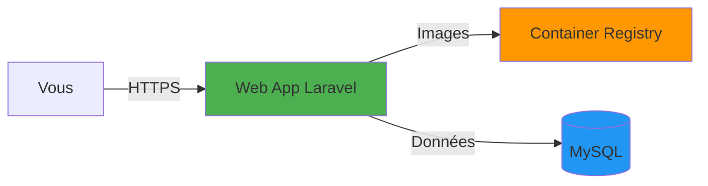

# Guide de démarrage rapide - TERRACLOUD

## Bienvenue

Ce guide vous accompagne dans le déploiement de votre première infrastructure TERRACLOUD sur Microsoft Azure. Nous allons déployer une application Laravel avec l'approche **PaaS** (la plus simple) pour commencer.

## Prérequis

### Avant de commencer

Vous aurez besoin de:

- Un ordinateur avec **Linux**, **macOS** ou **Windows WSL2**
- Une connexion Internet stable
- **30 minutes** de temps disponible
- Un accès à l'**Azure Subscription Epitech** (fourni)

## Étape 1: Installation des outils (15 minutes)

### 1.1. Azure CLI

L'outil en ligne de commande pour interagir avec Azure.

**Ubuntu/Debian:**
```bash
curl -sL https://aka.ms/InstallAzureCLIDeb | sudo bash
```

**macOS:**
```bash
brew update && brew install azure-cli
```

**Windows WSL:**
```bash
curl -sL https://aka.ms/InstallAzureCLIDeb | sudo bash
```

**Vérification:**
```bash
az --version
# Doit afficher version 2.40+
```

### 1.2. Terraform

L'outil d'Infrastructure as Code pour créer les ressources Azure.

**Ubuntu/Debian:**
```bash
wget -O- https://apt.releases.hashicorp.com/gpg | sudo gpg --dearmor -o /usr/share/keyrings/hashicorp-archive-keyring.gpg
echo "deb [signed-by=/usr/share/keyrings/hashicorp-archive-keyring.gpg] https://apt.releases.hashicorp.com $(lsb_release -cs) main" | sudo tee /etc/apt/sources.list.d/hashicorp.list
sudo apt update && sudo apt install terraform
```

**macOS:**
```bash
brew tap hashicorp/tap
brew install hashicorp/tap/terraform
```

**Vérification:**
```bash
terraform --version
# Doit afficher version 1.0+
```

### 1.3. Docker

Pour construire les images de conteneurs.

**Ubuntu/Debian:**
```bash
curl -fsSL https://get.docker.com -o get-docker.sh
sudo sh get-docker.sh
sudo usermod -aG docker $USER
newgrp docker
```

**macOS:**
```bash
# Télécharger et installer Docker Desktop
# https://www.docker.com/products/docker-desktop
```

**Vérification:**
```bash
docker --version
# Doit afficher version 20.10+
```

### 1.4. Git

Pour cloner le projet.

```bash
# Ubuntu/Debian
sudo apt install git

# macOS
brew install git
```

**Vérification:**
```bash
git --version
```

## Étape 2: Connexion à Azure (5 minutes)

### 2.1. Se connecter

```bash
# Ouvrir la page de connexion Azure
az login
```

Une page web s'ouvre. Connectez-vous avec vos identifiants Epitech.

### 2.2. Définir la subscription

```bash
# Définir la subscription Epitech
az account set --subscription "6b9318b1-2215-418a-b0fd-ba0832e9b333"

# Vérifier
az account show --output table
```

Vous devriez voir:
```
Name        SubscriptionId                        TenantId
----------  ------------------------------------  ------------------------------------
Sub T-CLO   6b9318b1-2215-418a-b0fd-ba0832e9b333  xxxxxxxx-xxxx-xxxx-xxxx-xxxxxxxxxxxx
```

## Étape 3: Cloner le projet (2 minutes)

```bash
# Créer un dossier de travail
mkdir -p ~/Epitech
cd ~/Epitech

# Cloner le projet
git clone https://github.com/Epitech-NSA/t-clo-axel

# Entrer dans le projet
cd t-clo-axel

# Vérifier la structure
ls -la
```

Vous devriez voir:
```
docs/
terraform/
ansible/
sample-app-master/
README.md
```

## Étape 4: Préparer la configuration (3 minutes)

### 4.1. Se positionner dans l'environnement dev

```bash
cd terraform/envs/dev
```

### 4.2. Créer le fichier de configuration

```bash
# Copier le template
cp terraform.tfvars.example terraform.tfvars

# Éditer le fichier
nano terraform.tfvars
```

### 4.3. Définir le mot de passe MySQL

Dans l'éditeur, modifiez cette ligne:

```hcl
mysql_admin_password = "VotreMotDePasseSecurise123!"
```

**Règles pour le mot de passe:**
- Au moins 8 caractères
- Lettres majuscules et minuscules
- Au moins un chiffre
- Au moins un caractère spécial (!@#$%)

**Exemple:**
```hcl
mysql_admin_password = "TerraCloud2024!"
```

Sauvegarder (`Ctrl+O`) et quitter (`Ctrl+X`).

## Étape 5: Déployer l'infrastructure (10-15 minutes)


### 5.1. Initialiser Terraform

```bash
terraform init
```

Vous verrez:
```
Initializing the backend...
Initializing provider plugins...
- Installing hashicorp/azurerm...
Terraform has been successfully initialized!
```

### 5.2. Voir le plan de déploiement

```bash
terraform plan -target=module.rg \
               -target=module.network \
               -target=module.acr \
               -target=module.mysql \
               -target=module.appservice
```

Terraform affiche les ressources qui seront créées. Vérifiez qu'il n'y a pas d'erreurs.

### 5.3. Déployer

```bash
terraform apply -target=module.rg \
                -target=module.network \
                -target=module.acr \
                -target=module.mysql \
                -target=module.appservice
```

Terraform demande confirmation:
```
Do you want to perform these actions?
  Terraform will perform the actions described above.
  Only 'yes' will be accepted to approve.

  Enter a value:
```

Tapez `yes` et appuyez sur Entrée.

**Attendez 10-15 minutes.** Terraform va créer:
1. Le Resource Group
2. Le Virtual Network
3. Le Container Registry
4. La base de données MySQL
5. L'App Service et l'application

Vous verrez défiler les messages:
```
module.rg.azurerm_resource_group.main: Creating...
module.rg.azurerm_resource_group.main: Creation complete!
module.network.azurerm_virtual_network.main: Creating...
...
```

### 5.4. Récupérer l'URL de l'application

Une fois terminé, Terraform affiche les outputs:

```bash
# Afficher l'URL
terraform output webapp_url
```

Sortie:
```
"https://tc-dev-web-frc-01.azurewebsites.net"
```

## Étape 6: Accéder à l'application (1 minute)

### 6.1. Tester avec curl

```bash
# Récupérer l'URL
WEBAPP_URL=$(terraform output -raw webapp_url)

# Tester
curl -I $WEBAPP_URL
```

Réponse attendue:
```
HTTP/2 200
content-type: text/html; charset=UTF-8
...
```

### 6.2. Ouvrir dans le navigateur

```bash
# Linux
xdg-open $WEBAPP_URL

# macOS
open $WEBAPP_URL

# Windows WSL
cmd.exe /c start $WEBAPP_URL
```

Vous devriez voir l'application Laravel!

## Étape 7: Exécuter les migrations (2 minutes)

Pour initialiser la base de données:

```bash
# Se connecter en SSH à l'application
az webapp ssh --name tc-dev-web-frc-01 --resource-group rg-nan_1
```

Dans le conteneur:
```bash
cd /var/www/html
php artisan migrate --force
php artisan db:seed --force
exit
```

Rafraîchissez la page de l'application, les données devraient être visibles!

## Félicitations!

Vous avez déployé votre première infrastructure Azure avec TERRACLOUD!

### Ce que vous avez créé



- Une application web Laravel accessible sur Internet
- Un registre Docker privé pour les images
- Une base de données MySQL managée
- Un réseau virtuel sécurisé
- Tout configuré automatiquement!

## Prochaines étapes

### Explorer l'infrastructure

```bash
# Lister les ressources créées
az resource list --resource-group rg-nan_1 --output table

# Voir les détails de l'App Service
az webapp show --name tc-dev-web-frc-01 --resource-group rg-nan_1

# Consulter les logs
az webapp log tail --name tc-dev-web-frc-01 --resource-group rg-nan_1
```

### Essayer l'approche IaaS

Pour comparer avec l'approche infrastructure:

```bash
# Voir le guide IaaS
cat docs/deployment/deployment-iaas.md
```

### Modifier l'application

```bash
# Se positionner dans l'app
cd ../../../sample-app-master/

# Modifier le code
# ... vos modifications ...

# Reconstruire et déployer
az acr login --name tcdevacrfrc01
docker build -t tcdevacrfrc01.azurecr.io/sample-app:latest .
docker push tcdevacrfrc01.azurecr.io/sample-app:latest

# Redémarrer l'app
az webapp restart --name tc-dev-web-frc-01 --resource-group rg-nan_1
```

## Nettoyage

**Important:** Pour éviter les frais Azure, détruisez les ressources quand vous avez terminé:

```bash
cd terraform/envs/dev

# Détruire toutes les ressources
terraform destroy

# Confirmer avec 'yes'
```

Cette commande supprime tout ce qui a été créé.

## Dépannage rapide

### Problème: "Error: Unable to acquire state lock"

**Solution:**
```bash
terraform force-unlock <LOCK_ID>
# Le LOCK_ID est affiché dans le message d'erreur
```

### Problème: "Error: building Container Registry"

**Solution:**
Le nom ACR doit être unique mondialement. Si `tcdevacrfrc01` est pris, modifiez dans `terraform.tfvars`:

```hcl
# Ajouter vos initiales par exemple
acr_name = "tcdevacr<vos-initiales>01"
```

### Problème: L'application ne répond pas (503)

**Solution:**
Attendre 2-3 minutes supplémentaires. Le démarrage du conteneur peut prendre du temps.

```bash
# Vérifier les logs
az webapp log tail --name tc-dev-web-frc-01 --resource-group rg-nan_1
```

### Problème: "Unauthorized" lors du docker push

**Solution:**
```bash
# Se reconnecter à ACR
az acr login --name tcdevacrfrc01
```

## Commandes utiles

### Voir l'état de l'infrastructure

```bash
cd terraform/envs/dev
terraform show
```

### Lister les ressources Azure

```bash
az resource list --resource-group rg-nan_1 --output table
```

### Redémarrer l'application

```bash
az webapp restart --name tc-dev-web-frc-01 --resource-group rg-nan_1
```

### Voir les coûts

```bash
# Via le portail Azure
az portal --output none
# Aller dans Cost Management + Billing
```

## Ressources supplémentaires

### Documentation TERRACLOUD

- [Vue d'ensemble de l'architecture](../architecture/overview.md)
- [Guide PaaS complet](../deployment/deployment-paas.md)
- [Guide utilisateur de l'application](user-guide.md)
- [Comparaison PaaS vs IaaS](../deployment/comparison.md)

### Documentation Azure

- [Azure App Service](https://learn.microsoft.com/fr-fr/azure/app-service/)
- [Azure Container Registry](https://learn.microsoft.com/fr-fr/azure/container-registry/)
- [Azure MySQL](https://learn.microsoft.com/fr-fr/azure/mysql/)

### Documentation Terraform

- [Terraform Azure Provider](https://registry.terraform.io/providers/hashicorp/azurerm/latest/docs)
- [Terraform Getting Started](https://learn.hashicorp.com/terraform)

## Besoin d'aide?

- Consultez la [section dépannage du guide PaaS](../deployment/deployment-paas.md#dépannage)
- Vérifiez les [issues GitHub du projet](#)
- Contactez votre encadrant Epitech

Bonne découverte de TERRACLOUD!

