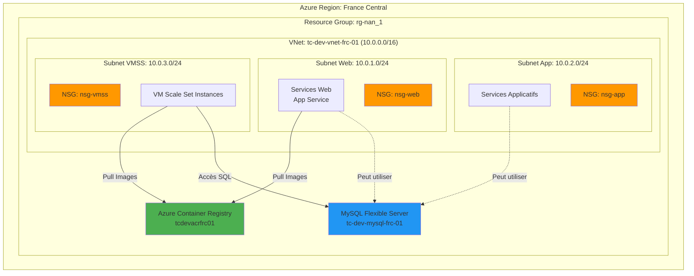
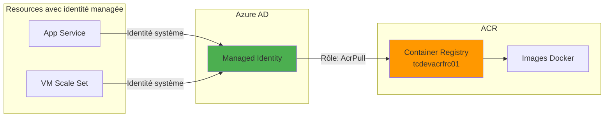
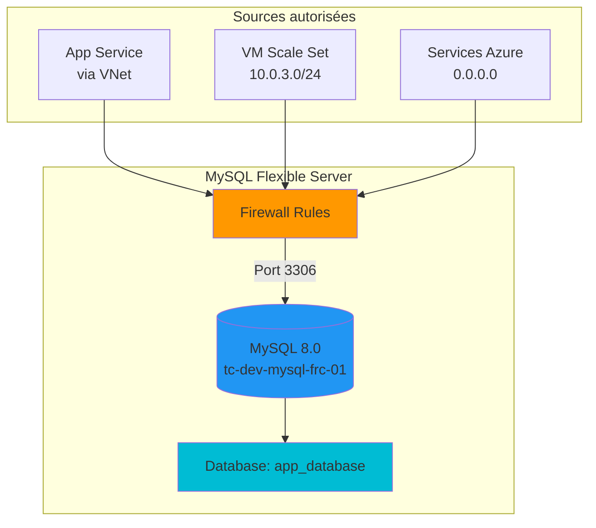

# Infrastructure partagée

## Vue d'ensemble

L'infrastructure partagée constitue le socle commun aux deux approches de déploiement (PaaS et IaaS). Elle comprend les ressources réseau, le registre de conteneurs et la base de données.

## Architecture réseau



## Resource Group

### Caractéristiques

- **Nom**: `rg-nan_1`
- **Région**: France Central
- **Type**: Ressource existante (ne pas supprimer)
- **Utilisation**: Conteneur pour toutes les ressources du projet

### Tags appliqués

Tous les tags standards TERRACLOUD sont appliqués:

```hcl
{
  project             = "TERRACLOUD"
  env                 = "dev"
  owner               = "etu-epitech"
  cost_center         = "nan_1"
  managedBy           = "terraform"
  tenant              = "Epitech"
  subscription        = "6b9318b1-2215-418a-b0fd-ba0832e9b333"
  data_classification = "internal"
  criticality         = "low"
}
```

## Réseau virtuel

### Virtual Network (VNet)

- **Nom**: `tc-dev-vnet-frc-01`
- **Plage d'adresses**: 10.0.0.0/16 (65,536 adresses)
- **DNS**: Serveurs DNS Azure par défaut
- **Protection DDoS**: Basic (inclus)

### Subnets

Le VNet est divisé en trois subnets spécialisés:

#### 1. Subnet Web (10.0.1.0/24)

- **Usage**: Services web (App Service, future intégration VNet)
- **Capacité**: 251 adresses utilisables
- **NSG**: `nsg-web`
- **Délégation**: Peut être délégué à Microsoft.Web/serverFarms

#### 2. Subnet App (10.0.2.0/24)

- **Usage**: Services applicatifs additionnels
- **Capacité**: 251 adresses utilisables
- **NSG**: `nsg-app`
- **État**: Réservé pour évolutions futures

#### 3. Subnet VMSS (10.0.3.0/24)

- **Usage**: VM Scale Set pour IaaS
- **Capacité**: 251 adresses utilisables (5-10 VMs max attendues)
- **NSG**: `nsg-vmss`
- **Fonction**: Hébergement des instances Ubuntu avec Docker

### Règles de sécurité réseau (NSG)

#### NSG VMSS - Règles entrantes

| Priorité | Nom | Port | Source | Destination | Action |
|-----------|-----|------|--------|-------------|--------|
| 100 | Allow-HTTP-Inbound | 80 | Internet | VMSS Subnet | Autoriser |
| 110 | Allow-SSH-Inbound | 22 | Internet | VMSS Subnet | Autoriser |

#### NSG VMSS - Règles sortantes

| Priorité | Nom | Port | Source | Destination | Action |
|-----------|-----|------|--------|-------------|--------|
| 100 | Allow-MySQL | 3306 | VMSS Subnet | VNet | Autoriser |
| 110 | Allow-ACR | 443 | VMSS Subnet | Internet | Autoriser |
| 120 | Allow-Internet | * | VMSS Subnet | Internet | Autoriser |

## Azure Container Registry (ACR)

### Configuration

- **Nom**: `tcdevacrfrc01`
- **SKU**: Basic
- **Admin activé**: Non (utilisation d'identités managées)
- **Visibilité**: Privé
- **Région**: France Central

### Format de nommage

Le nom suit l'exception Azure pour ACR (pas de tirets):

```
<prefix><env><type><region><index>
tcdevacrfrc01
```

### Dépôts d'images

| Dépôt | Description | Tags typiques |
|-------|-------------|---------------|
| `sample-app` | Application Laravel | `latest`, `v1.0`, `dev-XXXXXX` |

### Authentification



### Contrôle d'accès (RBAC)

Rôles assignés:

1. **App Service → ACR**: Rôle `AcrPull`
2. **VMSS → ACR**: Rôle `AcrPull`

### Commandes utiles

```bash
# Lister les images
az acr repository list --name tcdevacrfrc01

# Voir les tags d'une image
az acr repository show-tags --name tcdevacrfrc01 --repository sample-app

# Se connecter localement
az acr login --name tcdevacrfrc01

# Pousser une image
docker push tcdevacrfrc01.azurecr.io/sample-app:latest
```

## MySQL Flexible Server

### Configuration

- **Nom**: `tc-dev-mysql-frc-01`
- **Version**: 8.0
- **SKU**: B_Standard_B1ms (Burstable, 1 vCore, 2 GiB RAM)
- **Stockage**: 20 GiB (auto-growth activé)
- **Région**: France Central
- **Backup**: 7 jours de rétention
- **High Availability**: Non (environnement dev)

### Connectivité



### Base de données

- **Nom**: `app_database`
- **Charset**: utf8mb4
- **Collation**: utf8mb4_unicode_ci
- **Utilisateur**: `app_admin`

### Règles de pare-feu

| Nom | IP début | IP fin | Description |
|-----|----------|--------|-------------|
| `AllowAzureServices` | 0.0.0.0 | 0.0.0.0 | Services Azure (App Service) |
| `AllowVMSSSubnet` | 10.0.3.0 | 10.0.3.255 | Subnet VMSS |

### Chaîne de connexion

Format utilisé par l'application Laravel:

```bash
DB_CONNECTION=mysql
DB_HOST=tc-dev-mysql-frc-01.mysql.database.azure.com
DB_PORT=3306
DB_DATABASE=app_database
DB_USERNAME=app_admin
DB_PASSWORD=<secret>
```

### SSL/TLS

- **Require SSL**: Recommandé (activable)
- **TLS Version**: 1.2 minimum
- **Certificat**: Fourni par Azure

### Surveillance

Métriques disponibles:

- Connexions actives
- Connexions échouées
- CPU utilisé
- Stockage utilisé
- IOPS
- Latence des requêtes

### Backup et restauration

```bash
# Vérifier la configuration de backup
az mysql flexible-server show \
  --name tc-dev-mysql-frc-01 \
  --resource-group rg-nan_1 \
  --query "{backupRetentionDays:backup.backupRetentionDays}"

# Restaurer vers un point dans le temps
az mysql flexible-server restore \
  --name tc-dev-mysql-frc-02 \
  --resource-group rg-nan_1 \
  --source-server tc-dev-mysql-frc-01 \
  --restore-time "2024-01-15T13:00:00Z"
```

## Coûts mensuels estimés

| Ressource | SKU/Configuration | Coût mensuel (EUR) |
|-----------|-------------------|-------------------|
| Virtual Network | Standard | Gratuit |
| ACR | Basic | ~4 |
| MySQL Flexible Server | B_Standard_B1ms | ~15 |
| **Total Infrastructure Partagée** | | **~19** |

Les coûts sont partagés entre les deux approches de déploiement.

## Gestion du cycle de vie

### Création

L'infrastructure partagée est créée en premier lors du déploiement:

```bash
terraform apply -target=module.rg \
                -target=module.network \
                -target=module.acr \
                -target=module.mysql
```

### Mise à jour

Les mises à jour s'effectuent via Terraform:

```bash
# Voir les changements
terraform plan

# Appliquer les changements
terraform apply
```

### Suppression

L'infrastructure partagée est supprimée en dernier:

```bash
# Supprimer d'abord PaaS et IaaS
cd terraform
terraform workspace select dev
terraform destroy -var-file=envs/dev.tfvars -target=module.appservice
terraform destroy -var-file=envs/dev.tfvars -target=module.vmss

# Puis supprimer l'infrastructure partagée
terraform destroy -var-file=envs/dev.tfvars
```

## Bonnes pratiques

### Sécurité

1. Utiliser des identités managées plutôt que des credentials
2. Restreindre l'accès réseau avec des NSG
3. Activer SSL pour MySQL en production
4. Auditer régulièrement les règles de firewall

### Coûts

1. Utiliser des SKU Burstable pour l'environnement dev
2. Activer l'auto-growth du stockage MySQL
3. Monitorer l'utilisation avec Azure Cost Management
4. Supprimer les images Docker non utilisées dans ACR

### Haute disponibilité

Pour la production, considérer:

1. MySQL avec zone redundancy
2. ACR en SKU Premium avec géo-réplication
3. VNet avec peering inter-régions

## Documents connexes

- [Vue d'ensemble](overview.md) - Architecture générale
- [Architecture PaaS](architecture-paas.md) - Utilisation de l'infrastructure partagée en PaaS
- [Architecture IaaS](architecture-iaas.md) - Utilisation de l'infrastructure partagée en IaaS
- [Conventions de nommage](../conventions.md) - Standards de nommage Azure

