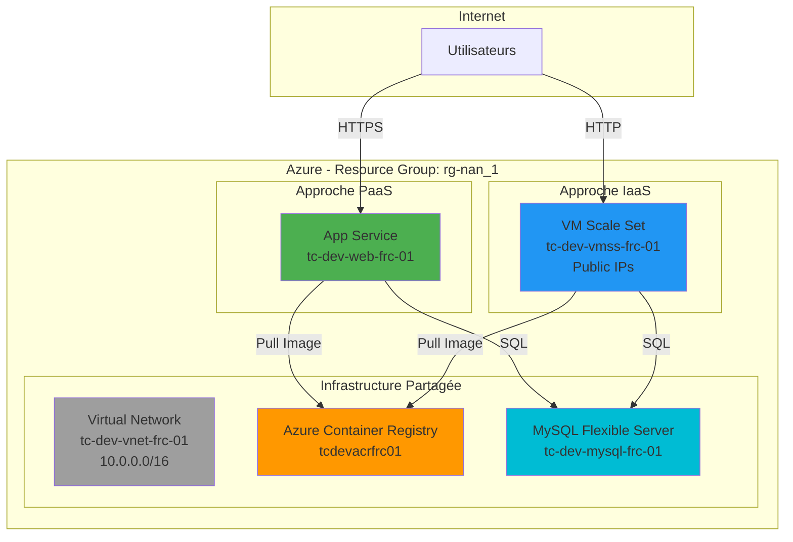
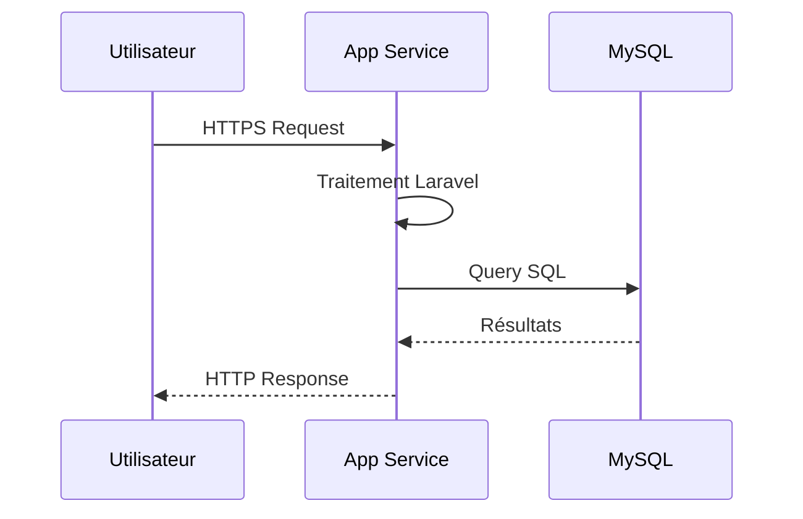
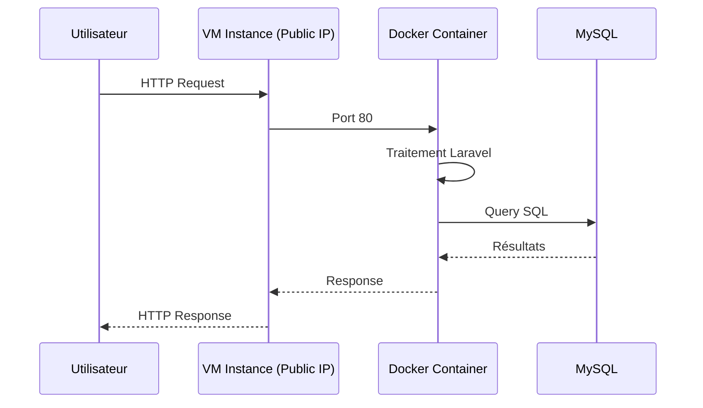
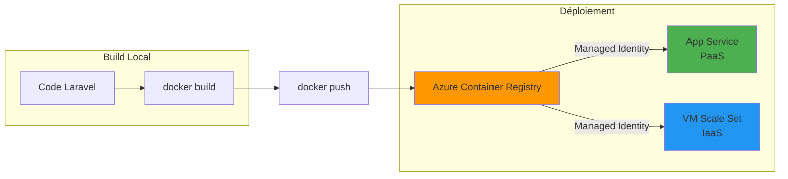

# Vue d'ensemble de l'architecture TERRACLOUD

## Introduction

TERRACLOUD est un projet d'Infrastructure as Code (IaC) qui illustre deux approches de déploiement d'une application web conteneurisée sur Microsoft Azure. Le projet compare les architectures **PaaS (Platform as a Service)** et **IaaS (Infrastructure as a Service)** pour héberger une application Laravel avec base de données MySQL.

## Architecture générale



## Principes architecturaux

### Infrastructure partagée

Les deux approches (PaaS et IaaS) partagent les ressources suivantes:

1. **Resource Group** (`rg-nan_1`): Conteneur logique pour toutes les ressources
2. **Virtual Network** (`tc-dev-vnet-frc-01`): Réseau privé 10.0.0.0/16
3. **Azure Container Registry** (`tcdevacrfrc01`): Registre Docker privé pour les images
4. **MySQL Flexible Server** (`tc-dev-mysql-frc-01`): Base de données managée

Cette mutualisation permet:
- Réduction des coûts (une seule base de données, un seul registre)
- Cohérence des données entre les deux déploiements
- Simplification de la gestion

### Infrastructure spécifique

Chaque approche possède ses propres ressources de compute:

**PaaS:**
- App Service Plan
- Web App

**IaaS:**
- VM Scale Set (VMs Ubuntu avec Public IPs)
- Network Security Groups spécifiques

## Choix techniques

### Conteneurisation avec Docker

L'application Laravel est conteneurisée, ce qui permet:
- Portabilité entre PaaS et IaaS
- Isolation des dépendances
- Déploiements reproductibles
- Versioning avec tags Docker

### Infrastructure as Code avec Terraform

Toute l'infrastructure est définie en code Terraform:
- Modules réutilisables
- Versioning de l'infrastructure
- Déploiements reproductibles
- Documentation intrinsèque du code

### Automatisation avec Ansible (IaaS uniquement)

Pour l'approche IaaS, Ansible gère:
- Installation de Docker sur les VMs
- Déploiement des conteneurs
- Configuration applicative
- Mises à jour coordonnées

## Environnements

Le projet supporte plusieurs environnements avec des configurations adaptées:

| Environnement | Code | VNet CIDR | Région | Politique d'arrêt |
|---------------|------|-----------|--------|-------------------|
| Développement | `dev` | 10.0.0.0/16 | France Central | 19:00-08:00 |
| Production | `prod` | 10.1.0.0/16 | France Central | 24/7 |

## Conventions de nommage

Toutes les ressources suivent le pattern Azure standard:

```
<prefix>-<env>-<type>-<region>-<index>
```

Exemples:
- VNet: `tc-dev-vnet-frc-01`
- App Service: `tc-dev-web-frc-01`
- VMSS: `tc-dev-vmss-frc-01`

Voir [conventions.md](../conventions.md) pour les détails complets.

## Sécurité

### Identité managée

Les deux approches utilisent des identités managées pour l'accès à ACR:
- Pas de stockage de credentials
- Authentification automatique via Azure AD
- Principe du moindre privilège (rôle AcrPull uniquement)

### Isolation réseau

- VNet avec subnets dédiés par fonction
- Network Security Groups (NSG) avec règles restrictives
- MySQL accessible uniquement depuis le VNet
- Accès SSH aux VMs IaaS via Public IPs individuelles

### Secrets et configuration

- Mots de passe MySQL stockés dans Terraform variables (sensibles)
- Variables d'environnement injectées dans les conteneurs
- Pas de secrets dans le code source ou les images Docker

## Comparaison des architectures

| Aspect | PaaS | IaaS |
|--------|------|------|
| **Complexité** | Simple | Complexe |
| **Nombre de ressources** | 6 | 12+ |
| **Temps de déploiement** | ~10 min | ~30 min |
| **Outils requis** | Terraform, Azure CLI | Terraform, Azure CLI, Ansible |
| **Maintenance** | Minimale | Manuelle |
| **Scalabilité** | Automatique | Configurable |
| **Contrôle** | Limité | Total |

## Flux de données

### Requête utilisateur - PaaS



### Requête utilisateur - IaaS



## Déploiement des images Docker



## Documents connexes

- [Infrastructure partagée](infrastructure-shared.md) - Détails sur les ressources communes
- [Architecture PaaS](architecture-paas.md) - Architecture détaillée de l'approche PaaS
- [Architecture IaaS](architecture-iaas.md) - Architecture détaillée de l'approche IaaS
- [Comparaison détaillée](../deployment/comparison.md) - Analyse comparative complète

